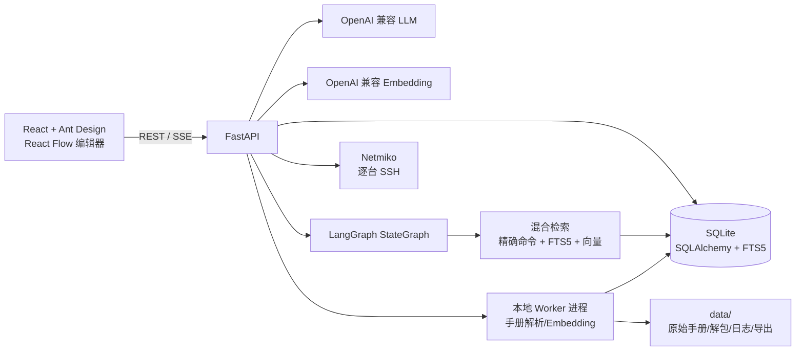

# AI Agent 工业交换机自动配置项目实现报告

> 文档用途：开发交接、故障定位和后续扩展。本文描述当前代码，而不是早期设计稿。
>
> 当前版本：`0.1.0`（本地单用户版）  
> 代码仓库：[chenjinyu0723/network-automation](https://github.com/chenjinyu0723/network-automation)  
> 许可证：[MIT](../LICENSE)

## 目录

1. [项目定位与边界](#1-项目定位与边界)
2. [总体架构](#2-总体架构)
3. [目录与模块职责](#3-目录与模块职责)
4. [启动、构建和数据](#4-启动构建和数据)
5. [数据模型](#5-数据模型)
6. [手册导入和知识抽取](#6-手册导入和知识抽取)
7. [型号与系列解析](#7-型号与系列解析)
8. [检索：精确 + FTS5 + Embedding](#8-检索精确--fts5--embedding)
9. [LangGraph 与配置规划](#9-langgraph-与配置规划)
10. [拓扑和端口](#10-拓扑和端口)
11. [命令生成、编辑与模板](#11-命令生成编辑与模板)
12. [Netmiko 执行](#12-netmiko-执行)
13. [Web 页面和 API 数据流](#13-web-页面和-api-数据流)
14. [配置项和兼容性](#14-配置项和兼容性)
15. [测试与验证](#15-测试与验证)
16. [常见故障排查](#16-常见故障排查)
17. [后续开发和交接清单](#17-后续开发和交接清单)

## 1. 项目定位与边界

项目把“拓扑 + 配置需求”转成“每台设备一组可审阅、可编辑的 CLI 草案”，并允许用户逐台确认后通过 Netmiko 下发。手册不是写死在代码里的厂商模板，而是用户导入后在本机解析、索引和检索的知识源。

当前明确边界：

- 应用是 React + Ant Design 前端、FastAPI 后端的本地单用户 Web/桌面应用。
- 默认数据存 SQLite；Embedding 向量以 Float32 BLOB 存在 SQLite，CPU 计算余弦相似度。
- LLM 和 Embedding 均通过 OpenAI 兼容 HTTP 接口调用。没有 GPU、云向量库或专有 SaaS 依赖。
- Neo4j、专用向量数据库不是当前运行依赖。它们可以在后续规模化时引入，但会增加服务部署、备份和桌面打包复杂度；当前手册规模下 SQLite FTS5 + 向量 BLOB 足够。
- 模型只能生成草案和审阅建议。用户可以编辑思路和命令，系统不把模型审阅结论当成用户批准。
- 下发始终逐台进行；执行前需要用户确认当前设备的命令。系统会一次性调用 Netmiko `send_config_set`，随后执行验证，验证成功才自动 `save`。
- PC SSH ping 验收已移除；PC 仍可作为拓扑和连通性需求中的端点，但不被当作 SSH 设备。

不应把当前实现理解为“任意厂商、任意型号、任意命令都能百分之百正确”。通用路径会尽力检索并生成可编辑草案；设备版本差异、命令语法和硬件特性仍需人工审阅和真实设备验证。

## 2. 总体架构



运行时有三个边界：

1. **浏览器/桌面 WebView** 只负责交互和展示，不持有 LLM 密钥或长期 SSH 密码。
2. **FastAPI** 负责业务编排、SQLite 事务、SSE 事件和执行请求。
3. **本地 Worker/Netmiko** 负责长耗时手册解析、Embedding 构建和设备连接，避免阻塞 HTTP 请求。

## 3. 目录与模块职责

```text
.
├─ apps/
│  ├─ api/app/
│  │  ├─ main.py                 # FastAPI 创建、静态前端挂载、启动恢复
│  │  ├─ desktop.py              # pywebview 入口、动态 localhost 端口、文件对话框
│  │  ├─ api/routes.py           # REST/SSE 路由及后台任务启动
│  │  ├─ core/config.py          # APP_DATA_DIR 和本地路径
│  │  ├─ db.py                   # SQLite 引擎、WAL、迁移、会话
│  │  ├─ models.py               # SQLAlchemy 模型和枚举
│  │  ├─ schemas.py              # Pydantic 请求/响应模型
│  │  ├─ agents/graph.py         # LangGraph 节点和状态
│  │  ├─ ingestion/
│  │  │  ├─ pipeline.py          # 文件格式识别、导入任务、断点恢复
│  │  │  ├─ chm.py               # CHM 解包后的 HTML/TOC/命令页解析
│  │  │  └─ worker.py             # 子进程入口
│  │  ├─ retrieval/
│  │  │  ├─ hybrid.py            # 精确匹配、SQLite FTS5、余弦融合
│  │  │  ├─ active.py            # 两轮 LLM 决策检索
│  │  │  ├─ embeddings.py         # 批量向量化、BLOB 写入
│  │  │  └─ worker.py             # Embedding 子进程入口
│  │  ├─ llm/client.py           # OpenAI 兼容调用、thinking、JSON 解析修复
│  │  ├─ planning/
│  │  │  ├─ service.py            # 任务、思路、逐设备规划和持久化
│  │  │  ├─ llm_refinement.py     # 需求/思路结构化
│  │  │  ├─ llm_command_plan.py   # 命令计划生成和修复
│  │  │  ├─ llm_command_review.py # 命令审阅
│  │  │  ├─ dialect.py             # Huawei/H3C/Cisco/Arista/通用方言
│  │  │  └─ runtime.py             # 取消令牌、事件落库、运行注册表
│  │  ├─ execution/service.py     # Netmiko 连接、配置、验证、save、Undo
│  │  ├─ archive_service.py       # 手册/拓扑/模板归档导入导出
│  │  ├─ template_service.py      # 模板快照及敏感字段清理
│  │  ├─ model_resolution.py      # 型号/系列解析
│  │  └─ ports.py                 # GE/GigabitEthernet 端口归一化
│  ├─ api/tests/                  # 后端单元、集成和流式事件测试
│  └─ web/src/
│     ├─ app/App.tsx              # 导航和页面常驻挂载
│     ├─ api/client.ts            # Axios 类型化 API 客户端
│     ├─ features/manuals/        # 手册导入、检索、Embedding、归档
│     ├─ features/topology/       # React Flow 拓扑编辑
│     ├─ features/planning/       # 思路、命令规划、证据和状态侧栏
│     ├─ features/execution/      # 逐台下发、回显、Undo
│     ├─ features/templates/      # 模板 CRUD、可拖动拓扑预览
│     ├─ features/settings/       # LLM/Embedding 配置
│     └─ styles.css               # 页面布局和设备/连线视觉样式
├─ scripts/build_desktop.ps1     # 前端构建 + PyInstaller onedir
├─ docs/                         # 用户文档、验证报告、本文档
├─ data/                         # 开发运行数据（Git 忽略）
├─ pyproject.toml
└─ README.md
```

依赖方向应保持单向：`routes -> service -> retrieval/llm/models`；前端只能通过 `api/client.ts` 调用 API。不要在 React 组件中直接拼接 SQLite 或设备命令。

## 4. 启动、构建和数据

### 4.1 开发模式

```powershell
uv sync --extra dev
uv run uvicorn app.main:app --reload --app-dir apps/api
pnpm install --frozen-lockfile
pnpm --filter network-automation-web dev
```

后端默认 `http://127.0.0.1:8000`，Vite 默认 `http://127.0.0.1:5173`。从仓库根目录执行命令。`pnpm --dir apps/web install` 会绕过工作区安装，不作为标准步骤。

### 4.2 Windows 桌面版

```powershell
uv sync --extra dev --extra desktop
.\scripts\build_desktop.ps1
```

构建结果为 `release\NetworkAutomation\NetworkAutomation.exe`。这是 PyInstaller `onedir` 包，必须连同 `_internal` 和同级文件夹一起分发，不能只复制 exe。桌面入口启动 FastAPI（只监听 `127.0.0.1`），再用 WebView2 打开页面；WebView2 Runtime 是前提。

### 4.3 数据目录

| 环境 | 数据根目录 |
|---|---|
| 开发模式 | 仓库根目录 `data/`，可用 `APP_DATA_DIR` 覆盖 |
| 冻结桌面版 | `%LOCALAPPDATA%\\NetworkAutomation\\data` |

下面的子目录由 `AppPaths.ensure()` 自动创建：

- `network_automation.db`：SQLite 数据库；
- `manuals/original/`：用户导入的原始手册；
- `manuals/extracted/`：CHM 解包或格式解析结果；
- `exports/`：服务端临时导出；
- `logs/`：导入 Worker 等后台日志。

API Key 通过系统 keyring 保存引用，SQLite 只记录“是否已配置”；SSH 密码只在当前 Netmiko 连接中使用，不写入任务、执行记录或模板。

## 5. 数据模型

### 5.1 手册与知识

`Manual` 是一本导入手册，记录文件格式、品牌/版本（可为空）、CLI profile、解析状态和统计数字。`ImportJob` 记录异步导入进度。

`KnowledgeDocument` 是检索的页面级单元，包含原始路径、标题、目录路径、页面类型、正文和元数据。`Command` 从页面提取命令名、语法、视图、参数、前置条件、约束、示例和证据 JSON；同一本手册同一页面的同一规范命令唯一。

`DeviceModel`、`ModelAlias`、`ModelEvidence` 和 `CommandApplicability` 保留型号/系列信息及适用性证据。当前任务由用户选择手册，型号映射主要用于审计和辅助检索，不构成硬门禁。

`EmbeddingJob` 和 `CommandEmbedding` 保存索引任务及向量。向量按 `(command_id, model)` 唯一，BLOB 采用 Float32；重新导入或源文本变化时通过 `source_hash` 重建。

### 5.2 拓扑、规划和执行

- `Topology`：拓扑名称。
- `TopologyRevision`：不可覆盖的版本快照，`graph_json` 包含节点和链路。
- 节点字段：`id/kind/name/x/y`，设备 IP、前缀、网关、SSH 主机/端口/账户、识别型号、保护端口均独立保存。
- 链路字段：`source/target/source_port/target_port`。端口文本按用户输入原样保存。
- `ConfigTask`：选择的拓扑版本、手册、需求文本、配置思路、任务状态、取消标志。
- `PlanningEvent`：任务的持久化阶段事件，供 SSE 断线重连。
- `DevicePlan`：每台设备的意图、检索证据、命令、验证、回滚草案、审批版本和审批时间。
- `ExecutionRun`：单台一次 apply/undo 执行；不含密码。
- `ExecutionCommand`：按序保存连接、预检、配置、验证、save 等完整回显。

任务状态常见流转：

```text
draft -> idea_ready -> planning -> needs_review -> approved
                                      \\-> cancelled/failed/blocked
approved -> executing -> completed
                     \\-> validation_failed/command_failed/failed
```

思路生成和命令生成可以取消；重新开始时，旧运行只允许清理自己的运行注册表，不得删除新运行的取消令牌。

## 6. 手册导入和知识抽取

### 6.1 统一管道

`detect_format()` 按扩展名选择解析器：

| 输入 | 处理 | 备注 |
|---|---|---|
| CHM | 先调用 7-Zip `7z x` 解包，再遍历 HTML | 不依赖 Windows `hh.exe -decompile` |
| PDF | PyMuPDF 按页提取文本 | 版式复杂、扫描件 OCR 目前需外部补充 |
| HTML/HTM | BeautifulSoup 清理正文、解析标题和链接 | 保留源相对路径 |
| TXT/MD | 编码回退读取 | 按段落/标题形成页面 |

每个页面提取：目录路径、标题、正文、命令标题/语法、CLI 视图、参数、前置条件、约束、注意事项、示例和型号/系列候选。原文和结构化字段同时保留，便于重新抽取和人工核对。

### 6.2 CHM 样例

首个验证样例是 `S1700, S5700, S6700 V600R025C00 命令参考.chm`。导入前需在 Windows 安装 7-Zip 并确保 `7z.exe` 可执行。当前入库统计为 8,914 页、8,714 条命令、0 个失败页；这些统计来自当前本地数据，换机器重新导入时应以导入任务结果为准。

CHM 特有内容是编译容器和 TOC；解包后页面本质仍是 HTML。通用管道只依赖“页面、标题、目录、正文、命令块”这些抽象，不把 Huawei 文件名或固定目录写死。

### 6.3 异步、断点和失败

上传接口只创建 `ImportJob`，本地子进程执行解析。每批页面在 SQLite 提交，`heartbeat_at/worker_pid` 用于启动恢复；进程中断后任务标记失败，重试可复用已落库页面。手册页失败不会静默发布为空知识库；状态可能为 `completed_with_issues`，页面和失败项可在管理页查看。

## 7. 型号与系列解析

解析器优先使用手册中的精确型号、别名和父级链；Huawei S 系列有保底规则：`S57xx -> S5700`、`S67xx -> S6700`、`S77xx -> S7700`、`S127xx -> S12700`，并兼容 `S5735/S5755 -> S5700` 的系列树语义。版本字符串（例如 `V200R001C00`）当前不作为阻断条件。

页面可查看和修正父级、名称、别名和审核状态。后续若引入更多厂商，应在 `model_resolution.py` 增加可解释的系列解析器和测试，不要在规划器里添加型号白名单。

## 8. 检索：精确 + FTS5 + Embedding

### 8.1 单次混合检索

`retrieval/hybrid.py` 对每个查询合并三类结果：

1. 命令规范名精确匹配；
2. SQLite FTS5 的命令/页面 BM25 匹配；
3. 已建索引时的 Embedding 余弦相似度。

结果按来源和分数融合，返回命令页以及页面正文摘要。一个页面可能对应多条命令，但进入 LLM 上下文时以页面去重，避免同页重复占用上下文。

Embedding 调用在 `retrieval/embeddings.py`：按设置的 batch size（默认 2，范围 1–20）发送 `input: [...]`，可选发送 `dimensions`；响应的 `data[i].embedding` 转成 Float32 BLOB。Embedding 服务不可用、未配置或索引不存在时自动降级为精确匹配 + FTS5，不会让命令面板为空。

### 8.2 两轮 LLM 引导检索

`retrieval/active.py` 是 ReAct 式应用编排，不依赖原生 function calling：

- 最多 2 轮；
- 每轮最多 5 个查询；
- 每轮先由应用执行混合检索，再把结果和上下文交给 LLM；
- LLM 只返回结构化的“保留页面 / `sufficient`、`search_more` 或 `not_found` / 下一批查询”；
- 应用执行下一轮查询，把上一轮保留页面和新页面按 `document_id` 去重后再交给模型；
- 第二轮后不执行第三轮；找不到也进入可编辑的最佳努力命令草案。

检索提示词包含：原始需求、完整拓扑事实、用户最终配置思路、已经选中的命令/页面和当前设备范围。种子查询会从需求/意图中提取，并从当前手册命令目录中补充命令锚点，减少“描述词”和真实命令标题不一致造成的召回损失。

## 9. LangGraph 与配置规划

### 9.1 图节点

`agents/graph.py` 建立 `StateGraph`，状态至少包含任务/设备、需求、意图、证据、检索审计、命令计划、候选命令、验证和审阅结果。节点顺序：

```text
validate_input
  -> refine_with_llm
  -> retrieve_evidence
  -> plan_commands_with_llm
  -> generate_commands
  -> validate_commands
  -> review_commands_with_llm
  -> prepare_human_review
  -> END
```

每个工具都是显式应用节点：LLM 输出 JSON，节点执行 SQLite/FTS/Embedding/本地编译，再将结果写回 State。模型不能直接执行 SQL、SSH 或任意 Python，也不依赖 provider 原生工具调用。

### 9.2 两阶段用户流程

**阶段一：配置思路。** 用户输入拓扑、选择手册和需求后，LLM 获取所有设备信息、全部交换机-交换机/PC-交换机链路及端口、IP/前缀/网关（没有就写“未提供”），生成可编辑思路。思路保存于 `ConfigTask.planning_idea`，空思路不会进入下一阶段。

**阶段二：逐设备命令。** 用户点击“确认思路并生成命令”后，任务按设备运行 LangGraph。每台完成后落库一个 `DevicePlan`，左侧设备列表可切换查看和编辑命令；右侧当前实现显示阶段状态，不展示原始 thinking、JSON 或正式模型 token。页面切换不会丢失已落库状态，SSE 断线后可从 `sequence` 继续读取。

规划器不是 VLAN 白名单。Huawei VLAN/多 VLAN 互通有专用确定性编译器；其它 OSPF、静态路由、STP、ACL、LACP、VRRP、堆叠等需求走通用“检索证据 + LLM 命令计划 + 方言/拓扑编译”路径，结果是草案，准确性取决于手册和模型。

### 9.3 Thinking 与 JSON

LLM 客户端固定使用：

```python
httpx.AsyncClient(
    verify=False,
    timeout=None,
    transport=httpx.AsyncHTTPTransport(verify=False),
)
```

首请求同时发送：

```python
extra_body={
    "chat_template_kwargs": {"enable_thinking": enabled},
    "thinking": {"type": "enabled" if enabled else "disabled"},
}
```

端点拒绝可选字段时按兼容形状重试。`adaptive` 只为证据审阅、命令计划、命令修复、命令审阅和结果诊断开启 thinking；静态检索、格式修复、拓扑校验和执行不启用。没有应用层墙钟超时，用户可通过停止任务取消当前规划。

结构化响应经 `parse_json_response()` 做对象提取和 Pydantic 校验；失败时最多进行一次“只修 JSON、不改变语义”的格式修复请求。命令计划仍失败时保留可编辑纯文本/最佳努力 CLI，并把失败原因写入审计，而不是清空页面。后续可参考 `D:\project\qwencode\qwen-code-main` 的 JSON harness 研究，但修改时应保持模型输出和本地校验分层。

### 9.4 提示词契约（接手时必须保持）

提示词不应把设备能力写成固定白名单；它们应该把“当前拓扑事实、用户需求、最终思路、手册证据、当前设备”放进上下文，把模型输出限制在可审计的 JSON 数据。当前四类契约如下：

| 节点 | 目的 | 主要输出 |
|---|---|---|
| 意图精炼 | 把自然语言需求拆成能力、检索词、实施步骤和缺口，同时起草可编辑思路 | `action=refine_intent`、`feature`、`capabilities`、`retrieval_terms`、`planning_steps`、`planning_idea`、`requirement_gaps` |
| 证据决策 | 在当前候选页面中选保留页，判断是否继续查询 | `action=manual_retrieval`、`verdict`、`selected_command_ids`、`next_queries` |
| 命令计划 | 说明每项操作要用哪一条手册命令或哪条证据绑定 CLI | `action=command_plan`、`operations[].purpose`、`invocations[]`、`validation_commands`、`assumptions`、`risks` |
| 独立审阅 | 只指出问题，不生成或修改命令 | `action=command_review`、`verdict`、`issues`、`required_changes` |

命令计划的最小形态如下，`command_id` 必须来自当前已选手册证据；通用路径可以使用 `cli`，但仍要经过本地编译器和用户审阅：

```json
{
  "action": "command_plan",
  "operations": [
    {
      "purpose": "在当前设备的上联接口启用需求中的功能",
      "invocations": [
        {
          "command_id": "<manual-command-id>",
          "syntax_index": 0,
          "arguments": {"<参数>": "<值>"},
          "target_port_ref": "<topology-link-port-or-null>",
          "cli": "<optional-one-line-cli>"
        }
      ]
    }
  ],
  "verification_notes": [],
  "validation_commands": [],
  "assumptions": [],
  "risks": []
}
```

新增字段时要同步修改 `schemas.py`、对应提示词、格式修复契约、持久化响应和测试；不要只放宽 JSON 解析而不增加语义校验。

## 10. 拓扑和端口

前端使用 `@xyflow/react`。节点为交换机和 PC；设备没有端点圆点，连线模式是“点击设备 A，再点击设备 B”，生成中心到中心的直线。点击连线后填写两端真实接口并保存。

端口显示和下发保留用户原文，因此 `GE0/0/0` 就生成 `interface GE0/0/0`。`ports.py` 只在去重、保护端口比较和验证回显时把 `GE` 与 `GigabitEthernet` 归一为同一身份。IP、前缀、网关、SSH 字段按节点独立存储，不会把上一个设备的值作为默认值。

拓扑保存为 revision；打开、改名、删除、单个拓扑导入/导出均由 API 完成。导出的拓扑可附带当前任务、配置思路、设备命令和验证信息；导入遇到同名拓扑时由前端询问是否覆盖。

## 11. 命令生成、编辑与模板

命令计划输入包括当前设备角色、完整拓扑、需求、最终思路、手册页面证据和方言。通用命令计划允许模型返回命令、视图和证据引用；本地编译器负责组合配置会话包装、过滤明显维护命令、校验端口来自当前拓扑并生成验证命令。

命令生成不是最终真相：

- 用户可以直接编辑设备命令；
- 用户确认的是当前设备的最终文本；
- LLM 审阅只提供提示，不批准、不改写、不触发下发；
- 找不到证据时仍显示带“未验证/人工审阅”标记的草案。

命令模板是用户存档，不是自动提示词上下文。快照只保存：拓扑图和链路接口、需求、配置思路、每台设备最终命令。不会保存 thinking、内部 JSON、证据审计或 SSH 密码。模板页支持增删改查、单个导入/导出和可拖动拓扑预览。

## 12. Netmiko 执行

执行 API 为单设备 apply/undo。前端先创建可追踪的 `execution_id`，再打开执行 SSE；请求异常时仍可通过历史轮询查看状态。

Huawei apply 流程：

1. 检查当前设备已审批、手册上下文、保护端口和命令块；
2. 以第一个独立 `return` 截断配置块，`return` 后残留命令不发送并记录在预检回显；
3. SSH 连接后发送 `display version` 作为审计；
4. 一次调用 `send_config_set` 发送完整命令；
5. 执行计划中的只读验证命令和必要的状态断言；
6. 全部验证通过才自动发送 `save`；save 失败会单独标记失败；
7. 全过程的设备名、阶段、命令和完整回显按序落到 `ExecutionCommand`，SSE 实时展示。

Undo 目前只支持已成功 VLAN Access 计划生成的受限回滚草案，并且只能进入拓扑中直连 PC 的端口，不允许保护端口和上联端口。其它能力的回滚暂未自动化。

## 13. Web 页面和 API 数据流

侧边栏顺序为：拓扑编辑、手册管理、模板管理、配置规划、下发与结果、设置。`App.tsx` 让页面常驻挂载，通过 `hidden` 切换，避免切换侧栏丢失本地工作区状态。

主要 API：

| 范围 | 关键接口 |
|---|---|
| 设置 | `GET/PUT /api/settings/providers`、`POST /api/settings/providers/test-llm` |
| 手册 | `POST /api/manuals/upload`、`GET /api/manual-imports/{id}`、`POST /api/manuals/{id}/embedding-index`、`POST /api/manuals/{id}/active-search` |
| 手册归档 | `GET/POST /api/manuals/{id}/export`、`POST /api/manuals/import`、`DELETE /api/manuals/{id}` |
| 型号/命令 | `GET/PATCH /api/models`、`GET /api/commands/search` |
| 拓扑 | `GET/POST/PUT/DELETE /api/topologies`、`GET/POST /api/topologies/{id}/export`、`POST /api/topologies/import` |
| 规划 | `POST /api/config-tasks`、`PUT /api/config-tasks/{id}/planning-idea`、`POST /api/config-tasks/{id}/generate-commands`、`POST /api/config-tasks/{id}/cancel` |
| 规划流 | `GET /api/config-tasks/{id}/events?after=N` |
| 设备审批 | `POST /api/config-tasks/{task}/devices/{plan}/approve` |
| 执行 | `POST /api/config-tasks/{task}/devices/{plan}/execute-huawei`、`POST .../undo-huawei`、`GET /api/executions/{id}/events` |
| 模板 | `GET/PUT/DELETE /api/templates`、`POST /api/config-tasks/{id}/templates`、导入/导出接口 |

文件导出在桌面版通过 pywebview 原生保存对话框由用户选路径；浏览器开发模式退回浏览器下载。页面会提示最终路径或默认下载目录。

## 14. 配置项和兼容性

设置页保存非敏感字段：LLM 的 `llm_base_url`、`llm_model`、`llm_temperature`、`llm_thinking_mode`；Embedding 的 `embedding_base_url`、`embedding_model`、`embedding_dimensions`、`embedding_batch_size`（默认 2）。API Key 只进入系统 keyring，不返回明文。

Base URL 可填 `/v1/`、完整 `/v1/chat/completions` 或 `/v1/embeddings`，客户端会规范化到 `/v1/`。Embedding 供应商若要求 `dimensions`，填写实际维度；留空则不发送该字段。HTTP 证书校验按项目约束固定关闭，生产环境若要恢复证书校验需同时评估供应商和兼容性测试。

## 15. 测试与验证

```powershell
uv run pytest -q
uv run ruff check apps/api/app
Set-Location apps/web
& .\node_modules\.bin\tsc.cmd -b
& .\node_modules\.bin\vite.cmd build
```

测试覆盖手册/归档、Embedding 客户端、混合检索、主动检索、规划集成、异步命令生成、执行 SSE、模板和设置。当前回归基线为后端 `122 passed`，前端 TypeScript/Vite 构建通过；改动后应以本机实际输出为准。

历史场景报告见 [常用组网场景验证报告](常用组网场景验证报告.md)。其中 8 个基础场景 + 8 个模板变体为离线命令草案审阅，不能替代真实设备验证，也不应当作所有厂商/版本均正确的证明。

建议新增能力时按三层测试：纯函数（端口、系列、JSON）、Fake LLM/SQLite（检索/取消/恢复）和授权实验设备（只读预检、单台下发、验证/save）。

## 16. 常见故障排查

### 手册导入没有进度

检查 7-Zip 和 `7z.exe`，查看 `data/logs/manual-import-*.log` 与导入任务状态。CHM 解包没有 HTML 时任务会失败，不会发布空库；FastAPI 重启后可重试并复用已落库页面。

### Embedding 构建失败

检查 base URL、模型名、维度和批量大小。先用手册管理页主动检索确认 FTS5 正常，再重试索引；Embedding 不可用时系统仍可用精确 + FTS5。

### LLM 请求失败或 409

检查设置页连通性测试和服务端日志。thinking 可选字段会自动降级，但认证、模型不存在和限流会直接报错。规划没有应用层墙钟上限，可停止后重新开始。

### 下发回显异常

确认 SSH 字段、命令中的第一个 `return`、保护端口和执行历史。执行页会显示版本审计、完整配置回显、验证和 save；验证失败不会 save。

### EXE 打开无响应

确认分发整个 `release\NetworkAutomation\` 目录，检查 WebView2 Runtime 和 `%LOCALAPPDATA%\NetworkAutomation\data` 写入权限。发布目录可替换，运行数据应先备份。

## 17. 后续开发和交接清单

优先增加跨格式抽取评测集、真实设备回显样本、可插拔通用命令规则、归档版本迁移和持续集成中的取消/SSE/Worker/Netmiko 测试。只有当手册规模和并发确实超过 SQLite 能力时，再评估 Neo4j 或独立向量库，并先抽象 Repository 接口。

交接时至少验证：手册导入与重试、Embedding 构建和 FTS5 降级、拓扑保存/重开、思路为空门槛、逐设备命令生成、命令编辑审批、SSE 回显、模板归档和 EXE 完整目录。不要把模板命令自动注入新任务，也不要让 LLM 直接获得 SQL/SSH 工具权限。
