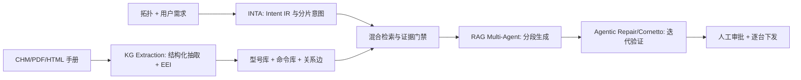
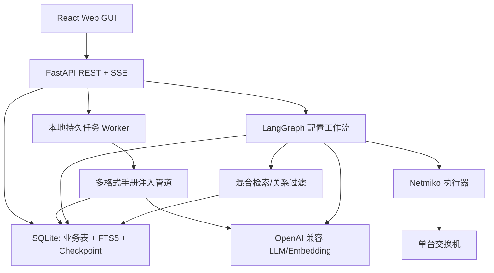
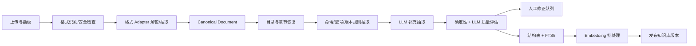
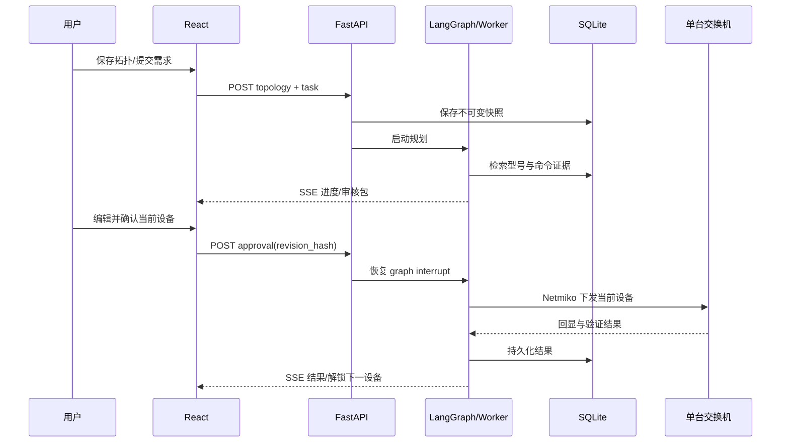

# AI Agent 工业交换机自动配置系统

## 技术选型与 App 规划文档

> 文档状态：规划评审稿（R + P 阶段）  
> 日期：2026-08-02  
> 已确认前提：React、SQLite、本地单用户；需要配置导出、回滚命令生成，以及人工确认后的逐台回滚下发。  
> 实现边界：本稿不实现业务代码。所有真实设备执行、Embedding 效果和 LLM 命令准确率均需在后续里程碑实测。

### 0.0 已确认实施决策（2026-08-02）

- 前端采用 Ant Design；拓扑画布采用 React Flow。
- `httpx verify=False` 按项目要求固定，不提供 UI 开关。
- 型号查询只在型号为空或用户主动点击时执行；查询前必须选择品牌/驱动范围。
- 一台设备的命令集通过审批且设备侧验证通过后，系统自动执行 `save`；`save` 的交互回显会留档。任何验证失败都不执行 `save`。
- 允许使用经授权的 PC SSH 执行 ping 验收；PC 的地址、凭据与最小命令白名单在执行阶段单独配置，不能从交换机凭据复用或猜测。
- 允许评估本地 Neo4j 与专用向量库，但首版基线仍为 SQLite 关系表 + FTS5 + CPU 向量检索。理由是首个 CHM 实测为 8,714 条命令，当前规模下专用服务的维护和备份复杂度大于收益；接口保持可替换。

---

## 0. 执行摘要

### 0.1 推荐结论

系统采用本地单机 Web 形态：React + TypeScript 前端，FastAPI 后端，SQLite 作为唯一持久化数据库，LangGraph 负责规划、检索、生成、验证和人工审批编排，Netmiko 负责逐台 SSH 查询与下发。LLM 与 Embedding 仅通过用户配置的 OpenAI 兼容接口调用；不依赖原生 function calling，不部署 GPU、小模型服务、云向量库、Neo4j、Redis、Celery 或任何专有 SaaS。

知识层不采用“把整本手册粗切后直接向量搜索”的单层 RAG。推荐使用以下组合：

1. 文档结构解析：保留目录、章节、命令页和原始证据定位。
2. 结构化命令库：保存命令语法、视图、参数、前置条件、约束、示例、版本和型号适用范围。
3. 型号图谱：在 SQLite 关系表中表达“具体 SKU → 产品族 → 系列 → 手册版本 → 章节/命令”的边，不要求图数据库。
4. 混合检索：型号和版本硬过滤 → FTS5/BM25 召回 → Embedding 召回 → 规则加权/LLM 轻量重排 → 证据门禁。
5. Intent IR：先把自然语言需求转换为厂商无关、可校验的结构化配置意图，再按每个原子意图检索命令。
6. 人在回路：每台设备的配置和回滚方案必须分别审核；前一台执行完成并验证后，才允许确认下一台。

### 0.2 资源红线结论

| 能力 | 推荐方案 | 是否触线 | 结论 |
|---|---|---:|---|
| LLM | `openai.AsyncOpenAI` + 用户提供的 OpenAI 兼容接口 | 否 | 可行；严格沿用指定调用方式 |
| Embedding | 同类 OpenAI 兼容接口，批量异步调用 | 否 | 可行；导入时生成，运行时仅查询向量 |
| 向量检索 | SQLite 存向量 BLOB + NumPy CPU 精确余弦检索 | 否 | 首版可行；无需向量服务 |
| 全文检索 | SQLite FTS5/BM25 | 否 | 可行；SQLite 内建能力 |
| 知识图谱 | SQLite 节点/边关系表 | 否 | 首版可行；允许后续评估本地 Neo4j |
| 文档抽取 | 7-Zip、HTML/PDF/文本本地解析器 | 否 | 可行；不依赖外部服务 |
| OCR | 可选 Tesseract CPU，仅处理扫描 PDF | 否，但需本机 CPU/安装包 | 默认关闭；按需启用并显式提示成本 |
| 7B 模型微调/本地推理 | LoRA/T4 或大内存 CPU | **是/不推荐** | 论文路线需要 GPU，排除出基线 |
| Batfish/仿真器 | 本地 CPU/Java 或虚拟设备资源 | 条件性 | 首版不依赖；未来增强项，需额外资源与厂商覆盖验证 |
| 云向量库/专有 SaaS | 不选 | **会触线** | 禁止进入方案依赖；本地专用向量库可作为二期评估 |

---

# 第一部分：R 阶段调研结论

## 1. 华为 CHM 手册实际拆解

### 1.1 样例与方法

样例文件：`D:\network-automation\S1700, S5700, S6700 V600R025C00 命令参考.chm`，原始大小 `17,011,861` 字节。

实际使用 `C:\Program Files\7-Zip\7z.exe x <file.chm> -o<temp-dir> -y` 解包成功。未使用 `hh.exe -decompile`，从而避开其可能静默生成空目录的问题。解包结果位于系统临时目录，仅用于本次走查，不作为项目产物。

### 1.2 体量与目录结构

| 指标 | 实测结果 | 统计口径 |
|---|---:|---|
| 解包文件数 | 8,951 | 递归统计全部文件 |
| 解包体积 | 92,791,502 字节 | 全部文件大小之和 |
| HTML 页面 | 8,914 | `.html` 文件数 |
| TOC 唯一链接 | 8,914 | `.hhc` 中 `Local` 唯一值 |
| 命令页 | 8,714 | TOC 第 4 层条目；同时具有 `clifunc`、`cliformat` 页面结构 |
| 章节/结构页 | 198 | 文件名为 `*_title.html` |
| 前置主题页 | 2 | “前言”“不支持命令列表” |
| 具体型号/产品 token 候选 | 171 | 排除 S1700/S5700/S6700 三个系列名后的正则候选；仍混有产品族与 SKU，需分类审核 |
| 含显式型号限制的命令页 | 约 5,002 | 按“该命令仅在/在……产品上支持”类正文模式统计；需用正式解析器复核 |

TOC 层级实测为：

```text
第 1 层：前言 / 命令参考 / 不支持命令列表
└─ 第 2 层：20 个功能域
   ├─ 基础配置、系统管理、接口管理、虚拟化、以太网交换
   ├─ IP 地址与服务、IP 路由、IP 组播、Segment Routing、MPLS、VPN
   ├─ WLAN、VXLAN、网络切片、可靠性、用户接入与认证
   └─ 安全、QoS、系统监控、工业网络
      └─ 第 3 层：177 个命令章节
         └─ 第 4 层：8,714 个命令条目
```

这一本 CHM 不是“若干大 HTML”，而是“一条命令一个结构化 HTML 页面”。这使首个样例的规则抽取可行，但不能由此假设其他品牌或 PDF 也具备同样结构。

### 1.3 页面编码与命令页格式

`.hhc` 与 HTML 页面声明 `charset=gb2312`，实际应以 GBK 兼容方式解码并保留替换字符统计。若按 UTF-8 读取会出现乱码。单个命令页包含：

- 元数据：`DC.Type=cliref`、`DC.Title`、`version=V600R025C00`、`brand=S1700, S5700, S6700 系列交换机`、`featurename`、`featuretype`、`DC.Identifier`、父主题关系。
- 固定区块：命令功能、命令格式、参数说明、视图、缺省级别、使用指南、使用实例。
- 正文约束：应用场景、前置条件、注意事项、配置影响、版本差异、具体产品支持范围。
- 导航关系：父主题、上一节、下一节。

真实页面 `BATCHCREATEVLAN(VLANOM).html` 的已核片段：

```text
标题：vlan batch
版本：V600R025C00
特性：VLAN / 以太网交换
命令功能：vlan batch 命令用来批量创建 VLAN；undo vlan batch 用来批量删除 VLAN。
命令格式：vlan batch { vlan-id1 [ to vlan-id2 ] } &<1-10>
参数范围：VLAN ID 1～4094
视图：系统视图
示例：
<HUAWEI> system-view
[HUAWEI] vlan batch 6 7 16 to 20
```

真实页面 `PORTLINKTYPE(VLANOM).html` 还证明了同系列内的差异必须结构化保存：

- `S5735I-L-V2 / S5735-S-V2 / S5735E-S-V2 / ...` 默认链路类型是 `negotiation-auto`。
- `S5732-H-V2 / S5755-H / S5755-S / S6730-H-V2 / ...` 默认链路类型是 `negotiation-desirable`。
- 页面明确指出 V600R024C00 前默认类型为 Access，V600R024C00 起默认值发生变化。

真实页面 `VLANADDDEFAULTPORT(VLANOM).html` 说明 `port default vlan vlan-id` 的前置条件包括：VLAN 存在时功能才生效；接口类型需为 Access、Dot1q-tunnel 或相应协商类型；接口必须是二层口；已加入 Eth-Trunk 的物理口不可使用。

真实页面 `VLANPORTTRUNK(VLANOM).html` 说明 `port trunk allow-pass vlan ...` 的前置条件是接口先成为 Trunk，且 `undo` 会联动删除该接口上的 MAC 地址表项。这些信息不能丢在普通文本块中，必须进入 `preconditions`、`effects` 和 `risks` 字段。

### 1.4 型号体系实测结论

手册页头的 `brand` 只声明 S1700/S5700/S6700 系列，`product` 元数据为空；具体支持范围主要散落在正文与“不支持命令列表”中。因此：

1. `product` 为空不能解释为“全系列所有款型都支持”。
2. 正则扫描发现 171 个非系列 token 候选，其中 S1700 前缀 2 个、S5700 前缀 137 个、S6700 前缀 32 个；它们混合了产品族与完整 SKU。
3. 高频产品族包括 `S5735-S-V2`、`S5755-H`、`S5755-S`、`S6730-H-V2`、`S6750-S` 等。
4. `S5735`、`S5735-S-V2`、`S5735-S48T4XE-XA-V2` 应分别保存为系列下的族/子族/具体 SKU，不能压成一个字符串字段。
5. “S5735/S5755 属于 S5700 系列”可由稳定命名规则提出候选，但必须绑定手册证据、置信度和人工修正状态；其他厂商不能复用华为前缀规则。

推荐的映射记录不是单一字典，而是：

```text
SKU S5735-S48T4XE-XA-V2
  → product_family S5735-S-V2
  → series S5700
  → manual_release V600R025C00
  → command applicability / exception evidence
```

### 1.5 CHM 特有要求与共通要求

| 类型 | 要求 |
|---|---|
| CHM 特有 | 必须优先用 7-Zip 解包；解析 `.hhc` TOC；处理 CHM 内部相对链接与 `#SYSTEM` 等特殊文件；识别 GB2312/GBK；不得依赖 `hh.exe -decompile` |
| HTML 共通 | 保留 DOM 标题层级、表格、代码块、提示框、链接、元数据和原始路径；正文清洗不能把命令关键字与参数粘连 |
| 所有手册共通 | 形成稳定文档 ID；保存品牌、系列、型号、版本、章节、命令、参数、视图、前置条件、约束、注意事项、示例、证据定位；记录抽取器版本与质量状态 |
| 所有格式共通 | 解析失败可重试、可局部重跑、可人工修正；不能在证据不足时把模型推断发布为事实 |

### 1.6 可行性与工作量判断

对该华为 CHM，目录与页面模板高度规则，规则抽取应覆盖绝大部分 8,714 个命令页，LLM 只需处理型号限制、隐含依赖和异常页面，成本可控。真正的工作量不在“把 HTML 转成文本”，而在以下四项：

1. 可靠解析命令语法树，而非只保存展示字符串。
2. 将 5,000 余页中的型号例外、版本差异和负向约束归一化。
3. 区分系列、产品族、具体 SKU，并避免正则误收。
4. 建立抽取质量评估集和人工修正闭环。

结论：CHM 首样例端到端可行；通用管道也可行，但 PDF/扫描件的结构恢复效果不可由该样例外推，必须分格式验收。

## 2. 最相关资料及其作用

| 优先级 | 资料 | 可复用方法 | 对本项目的边界 |
|---:|---|---|---|
| 1 | INTA（2501.08760） | Intent IR、分片意图、投票式检索、配置手册到命令手册交叉检索、语法引导增量生成 | 研究对象是配置翻译；本项目要从拓扑和需求规划，需新增拓扑约束与设备分解 |
| 2 | KG Extraction（2605.19180） | 细粒度 KG Schema、Extract-Evaluate-Improve、从原文重新生成而非修补错误结果 | 目标是测试知识抽取，不直接解决可执行配置生成 |
| 3 | RAG Multi-Agent（2606.01222） | 任务分解、检索对齐、分段验证、选择性重生成 | B5G/OAI 场景与交换机 CLI 不同；94.4% 不能外推 |
| 4 | Agentic Repair（2606.06212） | 动态检索、迭代编辑、验证器反馈；agentic 平均提升修复效果和安全性 | 使用正式网络验证器；本项目首版缺少等价的华为形式化验证 |
| 5 | NLM Reality Check（2205.01398） | 强调网络配置容错极低，验证比纯合成更现实 | 2022 年模型能力已过时，但风险判断仍有效 |
| 6 | Cornetto（2604.22513） | 231 个场景、功能正确性与回归检测；反对只用文本相似度 | 基准以仿真/形式化网络为基础，厂商覆盖与本项目不同 |
| 7 | Fine-tuned SLM（2512.02861） | 从手册构建“意图→配置”数据对，闭环 verifier | 需要 Tesla T4/GPU 微调且只覆盖 Cisco；违反当前资源红线，不选作基线 |
| 8 | LLM-NetCFG（2408.13298） | 意图到配置、验证闭环的系统分层 | 本地 7B 推理资源不符合本项目条件；准确率不可直接迁移 |
| 9 | GeNet（2407.08249） | 拓扑结构化表示对配置规划有启发 | 其重点是图像/手绘识别；本项目拓扑是结构化拖拽，不需要视觉模型 |
| 10 | 5G Local LLM + RAG（2511.21084） | 说明领域检索能改善配置问答/生成 | 本地 LLaMA 8B 需要项目不具备的算力，且领域是 5G |

可参考的开源仓库/工程：

- `langchain-ai/langgraph`：图状态、持久化、人机中断；用于编排思想和实现。
- `xyflow/xyflow`：React Flow；用于拖拽节点、端口和连线。
- `ktbyers/netmiko`：多厂商 SSH CLI 连接与命令发送。
- `oscarGLira/Fine-tuned-Configuration-Agent`：数据集生成和 verifier 思路；只参考，不采用其 GPU 路线。
- `batfish/batfish`：未来形式化网络验证候选；首版不依赖，需先验证 VRP/目标命令覆盖。

### 2.1 资料之间的关联



可直接复用的是架构原则，而非论文中的模型、数据集或指标。INTA 解决“意图如何带动手册检索”，KG Extraction 解决“手册如何变成结构化知识”，RAG Multi-Agent 解决“复杂任务如何分段生成与局部重试”，Agentic Repair/Cornetto 解决“为什么必须迭代验证”。四者组成完整链路。

效果有限或不适用的思路：

- 单轮 LLM 直接从需求生成 CLI：缺少型号、版本和证据约束。
- 纯向量 RAG：容易把语义相似但型号不支持的命令排在前面。
- 只做知识图谱：图关系能过滤和展开依赖，但不能独立完成自然语言意图匹配。
- 只做模板：高频 VLAN 场景可靠，但跨品牌、复杂协议和组合依赖维护成本迅速上升。
- 当前做微调：需要训练数据、GPU 与每品牌/版本维护，违反红线。
- 把 256k 上下文塞满整本手册：长上下文不等于正确定位，且无法提供稳定可审计证据。

## 3. “规划意图 ↔ 手册命令”主流方法比较

| 方法 | 为什么有价值 | 局限 | 当前约束下结论 |
|---|---|---|---|
| 纯 RAG | 实现快，手册更新后可重建索引 | 对型号/版本/否定条件不敏感，意图和命令词汇有语义鸿沟 | 不单独采用 |
| 混合 RAG | BM25 擅长命令关键字，Embedding 擅长意图同义表达 | 仍需业务过滤和证据门禁 | **推荐基线** |
| 轻量知识图谱 | 表达型号、版本、命令、前置/互斥关系，便于过滤与解释 | 抽取和维护成本高；图不负责模糊语义召回 | **与混合 RAG 组合**，用 SQLite 实现 |
| Intent IR | 将“给 PC 加 VLAN”变成可校验原子动作，缩小检索空间 | Schema 设计需覆盖业务域；LLM 解析仍可能错 | **推荐核心抽象** |
| 模板/设计模式库 | 高频配置确定性强，可生成依赖完整的命令骨架 | 覆盖有限，多厂商维护成本高 | **作为已验证模式优先级最高的通道** |
| 微调 | 可学习稳定的意图到命令分布 | 需要高质量数据和 GPU；版本更新需再训练 | **越界备选，不进入当前方案** |
| 纯知识图谱推理 | 关系清晰、可审计 | 无法很好理解开放式自然语言，图构建难 | 不单独采用 |

最终匹配链为：`Intent IR → 型号/版本硬过滤 → 已验证模式命中 → BM25 + Embedding 双路召回 → 关系扩展前置命令 → 规则/LLM 重排 → 证据充分性检查`。

## 4. 参考价值有限的资料

1. GeNet 的图像拓扑解析：本项目已经明确采用结构化拖拽拓扑，视觉识别不是当前问题。
2. Fine-tuned SLM 与 LLM-NetCFG 的本地模型部署：需要 GPU 或不可接受的 CPU 延迟，且模型/厂商覆盖不符；仅保留数据工程与 verifier 思路。
3. 5G RAG 与 B5G 多 Agent 的绝对指标：领域、配置载体、验证环境均不同，只能支持架构方向，不能承诺本项目准确率。
4. Cornetto/Batfish 形式化验证结果：能证明验证闭环的重要性，但不能假设 Batfish 完整解析本样例 VRP V600R025C00。
5. 综合分析笔记中的“本地小模型是最优解”：在本项目无 GPU 红线下不成立；推荐应改为“远端兼容 LLM + 本地结构化检索/规则验证”。

---

# 第二部分：P 阶段 App 规划

## 5. 需求拆分

### 5.1 功能模块清单

| 模块 | 功能 |
|---|---|
| 系统设置 | 配置 LLM/Embedding `base_url`、`api_key`、`model`、temperature、超时、批大小；连通性测试；密钥遮罩 |
| 手册导入 | 多本、多品牌、多版本、多格式上传；去重；异步抽取；进度、日志、失败项与重试 |
| 文档解析 | CHM/PDF/HTML/TXT/Markdown 适配；统一中间文档；目录、表格、代码块与证据定位 |
| 知识抽取 | 命令、参数、视图、约束、型号、版本、示例、正反向命令、依赖关系 |
| 型号库 | 系列/产品族/SKU 分层；映射证据与置信度；人工新增、合并、纠正和审计 |
| 命令知识库 | 结构化查询、全文/向量检索、适用范围过滤、证据页查看、人工修正 |
| 拓扑编辑 | 交换机/PC 节点拖拽、端口连线、IP/掩码/网关、交换机 SSH 与型号选择 |
| 配置任务 | 保存拓扑快照和需求；按设备拆分 Intent IR；规划、检索、生成、验证、回滚与导出 |
| 人工审批 | 展示需求、规划摘要、证据命令、候选命令、风险、验证命令和回滚；可编辑/确认 |
| 设备执行 | 缺型号时只读查询；逐台配置；逐条结果；超时/认证/CLI 错误分类；会话互斥 |
| 验证与回滚 | 下发前快照、设备侧验证、失败停止；人工确认后逐台回滚；结果留痕 |
| 导出 | 每台设备正向配置、回滚配置、验证命令、证据清单和任务 manifest |

### 5.2 明确不做

- 不做 LLDP/CDP 自动发现。
- 不做一键批量下发或自动并发下发。
- PC 默认不建立 SSH 会话、不自动执行 PC 命令。
- 不做局域网多人登录、RBAC、审批流或审计员角色。
- 不依赖原生 function/tool calling。
- 不承诺无设备/仿真器情况下的端到端网络行为证明。

## 6. 总体架构与数据流



本地 Worker 是随 App 启动的独立进程或受控子进程，不是外部服务。长时间手册导入通过 SQLite 持久任务表领取，避免 FastAPI `BackgroundTasks` 在进程重启后丢任务。SQLite 启用 WAL、短事务和单写者队列；解析与 Embedding 批处理在事务外完成。

## 7. 技术选型

### 7.1 LLM 与 Embedding 调用

**选择：** 官方 `openai` Python SDK 的 `AsyncOpenAI`，配合 `httpx.AsyncClient`；每个调用节点显式请求文本中的 JSON，不使用 `tools=`、`functions=` 或模型原生 function calling。

**为什么：** 完全符合指定参考代码和 OpenAI 兼容接口约束；异步客户端适合 FastAPI；可统一超时、重试、日志脱敏和取消。

**调用基线：**

```python
import openai, httpx

http_client = httpx.AsyncClient(
    verify=False,
    timeout=300.0,
    transport=httpx.AsyncHTTPTransport(verify=False),
)
llm_base_url = LLM_URL.replace('/v1/chat/completions', '/v1/')
client = openai.AsyncOpenAI(
    api_key=LLM_API_KEY,
    base_url=llm_base_url,
    http_client=http_client,
)
response = await client.chat.completions.create(
    model=model,
    messages=messages,
    temperature=temperature,
    extra_body={"chat_template_kwargs": {"enable_thinking": False}},
)
answer = response.choices[0].message.content if response.choices else ""
```

实现时只在 URL 确实以 `/v1/chat/completions` 结尾时归一化，并覆盖用户直接填写 `/v1/` 的情况，避免普通字符串替换误改代理路径。`verify=False` 是用户指定参考行为，但会降低 TLS 安全性；GUI 应显示告警，并预留 `verify_tls`，默认值最终由用户确认。

配置建议：规划 temperature 默认 `0.2`，命令生成/结构化抽取默认 `0.0`，允许按“规划、抽取、生成”三个角色分别覆盖；最大重试 2 次，指数退避；请求记录只保存 token/耗时/模型/哈希，不保存 api_key。

API key 推荐存 Windows Credential Manager（Python `keyring`），SQLite 仅保存 `secret_ref`。备选是本地 `.env` 文件并限制 ACL、加入 `.gitignore`；不推荐明文写入 SQLite。

**备选：** 直接用 `httpx` 调接口。优点是依赖少，缺点是偏离指定 SDK、需自维护协议兼容，故不选。

**可行性：** 可行，无 GPU 与外部辅助服务需求。LLM 服务本身是已允许资源。

### 7.2 LangGraph 工作流与无原生工具调用

**选择：** 一个主 `StateGraph`，按设备创建子流程；使用 LangGraph checkpoint 和 `interrupt` 实现人工暂停。模型只输出 Pydantic Schema 对应的 JSON 文本，应用解析后由普通 Python 节点执行工具。

**为什么：** LangGraph 擅长有状态、可恢复和循环工作流；人工审批是业务硬约束；显式节点让工具权限、输入校验和错误处理不依赖模型能力。

**节点设计：**

| 节点 | 输入 | 输出/状态变化 |
|---|---|---|
| `validate_task_input` | 拓扑快照、需求 | 结构/地址/链路校验结果 |
| `resolve_models` | 设备列表、凭据引用 | 用户型号或只读 SSH 查询结果；失败则暂停 |
| `bind_manual_scope` | 品牌/型号/版本 | 唯一或候选手册集、映射证据、冲突 |
| `build_intent_ir` | 需求、拓扑、设备角色 | 每设备原子意图、跨设备约束、验收条件 |
| `select_next_intent` | Intent IR | 当前待处理意图 |
| `decide_retrieval` | 当前意图、已有证据 | JSON 指令，如 `search_commands` / `expand_dependencies` / `finish` |
| `execute_retrieval` | 经校验的指令 | BM25/向量/关系查询结果 |
| `grade_evidence` | 候选与适用范围 | 证据充分/冲突/缺失；必要时回到检索 |
| `plan_device` | 意图与证据 | 可展示的规划摘要，不保存模型隐藏思维链 |
| `generate_candidate` | 证据、当前配置摘要 | 正向命令、验证命令、回滚草案、逐行引用 |
| `static_validate` | 候选命令 | 语法树、视图、参数、型号、风险、依赖检查 |
| `repair_candidate` | 结构化错误 | 局部重生成；最多 N 次，禁止无限循环 |
| `prepare_review` | 全部设备计划 | 可编辑审核包 |
| `human_approve_device` | 审核包 | LangGraph `interrupt`；确认/驳回/编辑 |
| `capture_pre_state` | 单设备命令 | 当前配置与关键状态快照、回滚可行性等级 |
| `execute_device` | 已批准且哈希未变的命令 | Netmiko 逐台结果；任何错误停止 |
| `post_verify` | 验证命令 | 设备侧验证结果与需求判定 |
| `human_approve_rollback` | 失败与回滚包 | 独立人工确认；不自动回滚 |
| `execute_rollback` | 已批准回滚命令 | 回滚结果与再次验证 |
| `finalize_task` | 全部状态 | 任务结论与导出清单 |

**状态传递：**

```json
{
  "task_id": "cfg_xxx",
  "topology_snapshot_id": "topo_xxx",
  "requirement_text": "...",
  "intent_ir": [],
  "device_order": ["sw1"],
  "current_device_id": "sw1",
  "resolved_models": {},
  "manual_scopes": {},
  "retrieval_queries": [],
  "evidence_refs": [],
  "device_plans": {},
  "candidate_commands": {},
  "rollback_plans": {},
  "validation_reports": {},
  "approval_revisions": {},
  "execution_ids": [],
  "retry_counts": {},
  "errors": []
}
```

状态中只放 `credential_id`，不放密码。大段原文、命令回显和向量只存数据库，状态中保存 ID，避免 checkpoint 膨胀。

**ReAct 式循环实现：** LLM 返回例如 `{"action":"search_commands","args":{"intent_id":"...","queries":[...],"top_k":20},"reason_summary":"..."}`；Pydantic 校验动作白名单、参数范围和 ID 所属任务；路由节点决定下一节点；工具节点执行；结果以结构化 observation 回填。解析失败进入一次 JSON 修复提示，再失败则暂停人工处理。任何模型文本都不能直接变成 Python 函数名、SQL、shell 或 Netmiko 调用。

**备选：** 自建状态机。依赖更少，但 checkpoint、循环、人工中断和可观测性都要重造，故不选。多 Agent 框架可作为未来实验，不需要为了“多 Agent”概念增加进程或服务。

**可行性：** 可行。需在实现开始时锁定 LangGraph 版本并验证 SQLite checkpointer 的同步/异步 API；当前属于待实测项。

### 7.3 多格式手册抽取与检索

**选择：** Adapter + Canonical Document + 规则优先/LLM 补充的通用管道。存储采用 SQLite 结构表、FTS5、Embedding BLOB 和关系边表。

**为什么：** 格式差异应止于 Adapter；后续型号抽取、命令抽取、质量评估和索引不应依赖 CHM/PDF。规则解析保留精确语法，LLM 只解释隐含语义，既节约调用又降低幻觉。

**备选：**

- LangChain 通用 loader：开发快，但结构与证据定位不够稳定；只可作为某些格式的适配器，不作为领域模型。
- `unstructured`：格式广，但依赖重、输出不稳定，CPU 成本高；后续按格式评估。
- 云 OCR/云文档解析：效果可能好，但违反外部服务红线，禁止。
- 本地 Neo4j + 专用向量库：用户已允许评估，关系/向量复杂查询能力更强；但会引入服务进程、备份/升级和 Windows 打包复杂度。首版不依赖，保留 repository 接口以便压测后替换。

**可行性：** CHM 实测可行；可搜索 PDF/HTML/TXT 可行；扫描 PDF 需 Tesseract CPU 且效果待测。

### 7.4 前端

**选择：** React + TypeScript + Vite；React Router；`@xyflow/react`；TanStack Query；Zustand；React Hook Form + Zod；沿用成熟组件库（实现阶段在 Ant Design 与 shadcn/ui 中二选一）。

**为什么：** 用户已选 React；React Flow 对自定义节点、Handle、Edge、选择、缩放、序列化支持成熟，非常贴合拓扑编辑；TanStack Query 管理后端状态，Zustand 只保留编辑器临时状态，避免双重数据源。

**备选：**

- Vue 3 + Vue Flow：能力足够，但与已确认 React 冲突。
- Cytoscape.js：大型图分析和自动布局强，但手绘表单化节点的开发体验不如 React Flow；可在未来大拓扑性能不足时替换画布层。
- JointJS/Rappid：功能强，但商业版能力与授权需要核查，不选。

**可行性：** 完全本地 CPU 可行，无 SaaS 依赖。

### 7.5 FastAPI 后端

**选择：** FastAPI + Pydantic v2 + SQLAlchemy 2 + Alembic + `aiosqlite`；REST 负责 CRUD，SSE 负责导入/规划/下发进度，敏感执行由服务层串行化。

**为什么：** 与异步 LLM 调用匹配；Schema 可复用到无工具调用的 JSON 校验；自动 OpenAPI 便于前端生成类型；SQLite 适合本地单用户。

**备选：** Django 功能完整但更重；Flask 简单但类型、异步和 API Schema 需要更多拼装；均不优于当前组合。

**可行性：** 可行。不要让长事务包住 LLM/Embedding/SSH 网络等待。

### 7.6 数据存储与向量检索

**选择：** SQLite 作为单一事实源，启用 WAL 与外键；FTS5 存全文索引；Embedding 以 float32 BLOB + 维度/模型/归一化标记保存；查询时按手册/型号/版本先过滤候选 ID，再由 NumPy 在 CPU 上分块精确计算余弦相似度。

**为什么：** 8,714 个命令页即使扩展到数万知识块，单用户查询仍能用 CPU 精确检索；无需服务进程，备份只需数据库与原始文件目录；过滤后精确检索还能避免近似索引召回的不确定性。

**容量估算：** 以 20,000 块、1,024 维 float32 为例，裸向量约 78 MiB；100,000 块约 391 MiB。实际维度由 Embedding 模型决定，导入时必须校验且不同模型不可混算。

**备选：**

- `sqlite-vec`：当块数增长、精确检索延迟超标时优先评估；优点是仍为 SQLite，缺点是 Windows 扩展分发与版本兼容需实测。
- FAISS CPU：速度高，但索引文件与 SQLite 事务一致性、Windows 打包更复杂；第二备选。
- Chroma/Qdrant/Milvus/云向量库：引入独立服务或资源，不选。

**可行性：** 首版可行；需要用真实 Embedding 维度和多本手册规模做延迟基准。

### 7.7 命令下发、验证与回滚

**选择：** Netmiko 同步连接运行在线程池中；一设备一互斥锁；只允许当前获批设备建立写会话。查询命令用 `send_command`，配置块用 `send_config_set`，保存配置优先用驱动的 `save_config`，交互式命令才使用受控 `send_command_timing`。

**为什么：** Netmiko 对多厂商 CLI 的 prompt、enable/config mode 和时序处理成熟；设备执行是阻塞 I/O，线程池能避免阻塞 FastAPI event loop。

安全门禁：

1. 凭据连接测试与型号查询为只读动作，仍需用户主动触发。
2. 每次执行绑定 `approved_revision_hash`；用户编辑后旧批准立即失效。
3. 禁止命令表默认包含重启、擦除、恢复出厂、批量删除、用户删除等高危模式；命中后强制二次审批或阻断。
4. 下发前抓取相关 `display current-configuration`/状态快照。
5. 每条命令保留回显、耗时、错误模式和脱敏会话日志。
6. 错误立即停止当前设备，不自动跳到下一台。
7. 一台设备的正向命令集已通过用户审批时，设备侧验证通过后自动执行 `save`；未通过验证时绝不保存。

回滚不能简单地给每行加 `undo`。生成策略按可靠性分级：

- A：从下发前快照计算精确差异，且命令库存在经验证逆操作。
- B：命令页提供 `undo`，但恢复原值需要快照参数。
- C：只有一般逆命令，可能有联动影响，必须人工编辑。
- D：不可可靠自动回滚，禁止自动生成可执行包，只给恢复建议与快照。

**备选：** NAPALM/NETCONF。它们在支持厂商上更结构化，但目标设备与版本覆盖需核实；CLI 手册是当前核心资产，因此 Netmiko 更稳妥。Ansible 需要额外运行时与 playbook 层，不适合本地单用户首版。

**可行性：** Netmiko 可行；具体 `device_type`、prompt、分页关闭、保存交互和错误正则必须用目标物理设备验证。

## 8. 手册知识注入通用管道

### 8.1 阶段与产物



1. **接收：** 计算 SHA-256、MIME/扩展名、文件名、大小；原文件只读保存；相同哈希复用或创建新版本引用。
2. **安全：** 限制单文件/解包后大小、文件数、路径深度；拒绝 `../`、绝对路径、符号链接和压缩炸弹；不执行手册中的脚本。
3. **Adapter：** 输出统一的页面、块、表格、代码、链接、目录和位置坐标。
4. **结构恢复：** 优先使用原目录；否则以标题层级、字体/版面、书签和编号重建。
5. **规则抽取：** HTML 类名、表头、代码块、命令语法符号、型号正则、版本正则、提示框。
6. **LLM 抽取：** 仅处理隐含前置、型号例外、影响、风险、同义意图；输出带 evidence span 的 JSON。
7. **质量门禁：** Schema、命令格式、参数范围、证据子串、型号闭包、冲突、重复和覆盖率。
8. **人工修正：** 对低置信、冲突、孤立 SKU、无证据关系和解析失败页排队。
9. **索引：** 命令粒度、场景粒度分别建立 FTS 与 Embedding；严禁跨模型混用向量。
10. **发布：** 只有通过门禁的 `knowledge_revision` 才可被规划任务引用；新导入不会静默改变旧任务证据。

### 8.2 格式 Adapter

| 格式 | 推荐实现 | 关键要求 | 失败降级 |
|---|---|---|---|
| CHM | 7-Zip 解包 + `.hhc` 解析 + HTML Adapter | GBK、内部链接、特殊文件、TOC | 无 `.hhc` 时从 HTML title/link 重建 |
| 文本型 PDF | PyMuPDF 主抽取，pdfplumber 辅助表格/坐标 | 页码、页眉页脚去重、跨页表格、代码行 | pypdf 交叉核对；低质量页入人工队列 |
| 扫描 PDF | Tesseract OCR CPU（可选） | 语言包、版面、命令字符准确性 | 禁止自动发布命令；人工复核 |
| HTML/目录/ZIP | lxml/BeautifulSoup，禁用脚本 | DOM 标题、表格、pre/code、相对链接 | Readability 仅用于普通文章，不用于命令页 |
| TXT/Markdown | charset-normalizer + 行/标题解析 | 编码、代码围栏、章节标记 | 按固定窗口生成低置信知识块 |

### 8.3 Canonical Document

```json
{
  "source_id": "src_xxx",
  "document_id": "doc_xxx",
  "format": "chm_html",
  "encoding": "gbk",
  "source_path": "v6r25c00/CLI/BATCHCREATEVLAN(VLANOM).html",
  "toc_path": ["命令参考", "以太网交换", "VLAN配置命令", "vlan batch"],
  "title": "vlan batch",
  "metadata": {"brand": "Huawei", "release": "V600R025C00"},
  "blocks": [
    {"type": "heading", "text": "命令格式"},
    {"type": "command_syntax", "text": "vlan batch ..."},
    {"type": "table", "rows": []},
    {"type": "notice", "severity": "note", "text": "..."}
  ],
  "source_locator": {"page": null, "dom_anchor": "...", "char_start": 0, "char_end": 100}
}
```

PDF 使用页码与 bbox，HTML 使用路径、DOM anchor 和字符区间。所有 LLM 事实必须能回指 `source_locator`。

### 8.4 命令知识结构

```json
{
  "command_id": "cmd_xxx",
  "canonical_name": "port default vlan",
  "vendor": "Huawei",
  "release": "V600R025C00",
  "feature": "VLAN",
  "syntax_variants": ["port default vlan <vlan-id>", "undo port default vlan [ <vlan-id> ]"],
  "syntax_ast": {},
  "views": ["GE二层接口视图", "10GE二层接口视图"],
  "parameters": [{"name": "vlan-id", "type": "integer", "min": 1, "max": 4094}],
  "preconditions": ["目标 VLAN 存在时功能才生效", "接口为二层口"],
  "constraints": ["目标 VLAN 不能是管理 VLAN", "物理口不能已加入 Eth-Trunk"],
  "effects": ["设置缺省 VLAN 并加入该 VLAN"],
  "risks": [],
  "examples": [],
  "supported_product_families": [],
  "unsupported_models": [],
  "applicability_mode": "inherit_with_exceptions",
  "inverse_command_id": "cmd_undo_xxx",
  "evidence_refs": ["ev_xxx"],
  "extraction_confidence": 0.98,
  "review_status": "auto_verified"
}
```

`applicability_mode` 至少支持：`explicit_allow`、`explicit_deny`、`inherit_with_exceptions`、`unknown`。未写型号限制不等于自动支持；它表示继承手册覆盖范围，但若产品映射或手册自身范围不确定，检索结果仍须降级。

### 8.5 型号映射自动构建与人工修正

自动构建分四路取证：

1. 手册标题/页头得到品牌、系列和版本。
2. 前言、产品表、支持/不支持列表得到产品族与 SKU。
3. 命令正文得到适用/不适用型号及版本例外。
4. 设备 `display version` 输出得到实际型号与运行版本，作为实例事实，不反写全局手册事实。

候选归一化流程：大小写和分隔符规范化 → 厂商特定 tokenizer → 系列前缀候选 → 最长产品族匹配 → SKU 归属 → 证据聚合 → 冲突检测 → 置信度 → 人工审核。

示例：

```text
输入 token：S5735-S48T4XE-XA-V2
候选 product_family：S5735-S-V2
候选 series：S5700
证据：CHM 页头覆盖 S5700；正文/产品列表出现 S5735-S-V2 与具体 SKU
状态：auto_candidate → reviewed/accepted
```

人工修正页必须支持：改父级、合并别名、拆分误合并、标记错误 token、修改适用/不适用命令、添加证据/备注、撤销到上一版本。人工修改以 overlay 保存，不覆盖原始抽取；重新导入时自动重放 overlay，冲突进入审核队列。

### 8.6 意图到命令匹配算法

每个 Intent IR 原子项产生三类查询：业务描述、预期状态、候选 CLI 关键词。检索评分建议：

```text
hard_filter = vendor ∧ release_compatible ∧ model_applicable ∧ feature_scope
score = 0.35 * normalized_bm25
      + 0.35 * embedding_similarity
      + 0.15 * intent_pattern_score
      + 0.10 * dependency_coverage
      + 0.05 * reviewed_evidence_bonus
      - incompatibility_penalty
```

权重只是初始假设，必须通过华为验证集调参。命中已人工验证的 `intent_pattern` 时先取模式骨架，再检索命令页核对版本；否则进入混合召回。Top-K 后展开 `requires / enters_view / conflicts_with / inverse_of / verifies_with` 关系，并由 LLM 对不超过约 10 个候选做结构化重排。

证据门禁：每条可执行命令必须至少有一个适用型号/版本的命令页证据；所有参数通过范围检查；需要的视图与前置命令齐全；存在冲突或 `unknown` 适用性时，不进入可执行状态，只能标记“需人工补证”。

## 9. Web GUI 规划

### 9.1 导航

左侧主导航：`拓扑`、`手册`、`型号库`、`配置任务`、`下发记录`、`设置`。首屏进入拓扑编辑器，不做营销落地页。顶部只显示当前项目/数据库状态、后台任务和全局错误。

典型工作路径：

```text
设置接口 → 注入手册 → 审核型号库 → 绘制拓扑 → 创建配置任务
→ 审核每台规划 → 逐台下发/验证 → 导出/必要时逐台回滚
```

### 9.2 设置页

组件：LLM 配置表单、Embedding 配置表单、角色级 temperature、超时/重试/批大小、TLS 校验提示、连接测试、模型返回预览、密钥遮罩与清除。

规则：api_key 永不回显，只显示“已配置”；保存空值不覆盖已有 secret；连接测试不写业务数据；测试结果显示端点、模型、耗时、错误类型，不显示请求头。

### 9.3 手册管理页

主区域是手册表格：品牌、版本、格式、文件哈希、导入时间、状态、总页/成功/失败、命令数、型号候选数、知识库 revision。工具栏提供导入、重试失败项、取消、归档、查看日志。

详情使用 Tab：

- 概览：阶段进度、吞吐、LLM/Embedding 调用量、质量指标。
- 章节：TOC 树与原始页预览。
- 命令：结构字段、适用型号、证据、冲突。
- 型号：系列/产品族/SKU 树和映射置信度。
- 失败项：页路径、阶段、错误、重试/人工标记。
- 修正记录：overlay 历史、操作者（本地用户）、时间和差异。

### 9.4 型号库页

左侧树显示品牌 → 系列 → 产品族 → SKU；右侧显示来源手册、版本覆盖、命令覆盖数、未决冲突和证据。使用下拉选择父级，不允许自由文本直接替换外键；修改前后预览受影响命令数。拓扑中的交换机型号只能从状态为 `published` 的型号记录选择。

### 9.5 拓扑编辑页

使用 React Flow 全屏画布，左侧图元栏含交换机、PC；上方是保存、撤销/重做、缩放适配、删除；右侧属性面板随选择变化。

设备通用字段：名称、设备类型、IPv4/IPv6 地址、掩码/前缀、网关、备注。交换机增加：品牌、型号库选择、管理/SSH IP、端口、用户名、密码 secret、Netmiko driver（默认由品牌/型号推导，高级选项可改）。PC 不显示 SSH 字段，`ssh_capable=false` 固定。

连线必须从端口 Handle 建立，保存 `source_port`、`target_port`、链路类型和备注。重复端口连接、网段冲突、缺少管理 IP 等问题在画布和侧栏同时标记。拓扑保存版本；配置任务引用不可变快照，后续编辑不改变既有任务。

### 9.6 配置规划页

按设备纵向排列，不使用嵌套卡片。每台设备包含五个并列区域：

1. 需求与 Intent IR。
2. 规划摘要与拓扑依据。
3. 检索到的命令、适用型号/版本、证据链接和置信度。
4. 生成的配置命令与逐行引用，可编辑。
5. 验证命令、回滚方案、风险和确认状态。

模型“规划思路”展示可审计的决策摘要，如“PC 接入口使用 Access；先创建 VLAN 再绑定接口”，不展示或持久化模型隐藏思维链。命令编辑器更改后立即重跑静态校验，并使原批准失效。

### 9.7 下发与结果页

顶部是严格顺序步骤条。只有当前设备出现“发送”按钮，按钮旁展示命令数、最后快照时间、审批 revision 和风险。发送前弹窗显示目标 IP、型号、正向命令、是否保存；不再显示密码。

执行区域按命令展示等待/运行/成功/警告/失败、回显摘要和耗时；下方显示验证结果。失败后只能选择“保留现场”“修改计划”“审核回滚”；回滚按钮必须再次确认。完成当前设备验证后才解锁下一设备。

### 9.8 前后端数据流



## 10. FastAPI API 与后端结构

主要 API：

| 路径 | 用途 |
|---|---|
| `/api/settings/llm`、`/embedding` | 读取脱敏配置、更新、连接测试 |
| `/api/manuals` | 上传、列表、详情、归档 |
| `/api/manual-imports/{id}` | 状态、取消、重试、SSE 事件 |
| `/api/models`、`/model-mappings` | 型号查询与 overlay 修正 |
| `/api/commands/search` | 带型号/版本过滤的知识查询 |
| `/api/topologies`、`/revisions` | 拓扑 CRUD 与版本 |
| `/api/config-tasks` | 创建、查看、启动规划、导出 |
| `/api/config-tasks/{id}/devices/{device_id}/approval` | 编辑/批准指定 revision |
| `/api/executions/{id}` | 单设备执行、状态流、停止 |
| `/api/rollbacks/{id}/approval` | 单设备回滚审批与执行 |

后端依赖方向为 `api → application services → domain → repositories/infrastructure`。LangGraph 节点调用 application service，不直接写 SQL；Netmiko adapter 不依赖 Web Schema；格式 Adapter 只输出 Canonical Document。

## 11. 文件/目录架构（规划态）

```text
network-automation/
├─ apps/
│  ├─ web/
│  │  ├─ src/
│  │  │  ├─ app/                 # Router、providers、全局布局
│  │  │  ├─ pages/               # settings/manuals/models/topology/tasks/executions
│  │  │  ├─ features/
│  │  │  │  ├─ manual-import/
│  │  │  │  ├─ model-catalog/
│  │  │  │  ├─ topology-editor/
│  │  │  │  ├─ config-planning/
│  │  │  │  └─ device-execution/
│  │  │  ├─ components/          # 通用表格、对话框、状态组件
│  │  │  ├─ api/                 # OpenAPI client、Query keys、SSE
│  │  │  ├─ stores/              # 仅 UI 临时状态
│  │  │  └─ types/
│  │  └─ tests/
│  └─ api/
│     └─ app/
│        ├─ main.py
│        ├─ api/                  # FastAPI routers/dependencies
│        ├─ core/                 # config、logging、secrets、errors
│        ├─ domain/               # 纯领域模型与策略
│        │  ├─ manuals/
│        │  ├─ inventory/
│        │  ├─ topology/
│        │  ├─ planning/
│        │  └─ execution/
│        ├─ application/          # use cases、DTO、事务边界
│        ├─ agents/
│        │  ├─ state.py
│        │  ├─ graph.py
│        │  ├─ nodes/
│        │  ├─ prompts/
│        │  └─ schemas/
│        ├─ ingestion/
│        │  ├─ pipeline.py
│        │  ├─ adapters/          # chm/pdf/html/text
│        │  ├─ extractors/        # command/model/relation
│        │  ├─ validators/
│        │  └─ indexers/
│        ├─ retrieval/            # filters、fts、vector、fusion、rerank
│        ├─ execution/             # netmiko adapter、driver profiles、error parser
│        ├─ llm/                   # 指定 AsyncOpenAI client、JSON parser、retry
│        ├─ persistence/           # SQLAlchemy models/repos/migrations
│        ├─ workers/               # SQLite-backed local jobs
│        └─ tests/
├─ data/                           # 默认 gitignored
│  ├─ app.db
│  ├─ manuals/original/
│  ├─ manuals/extracted/
│  ├─ exports/
│  └─ logs/
├─ schemas/                        # Intent IR、command knowledge JSON Schema
├─ fixtures/                       # 经授权的小型脱敏测试片段
├─ docs/
│  ├─ architecture/
│  ├─ validation/
│  └─ decisions/
├─ scripts/                        # 开发/迁移/质量统计脚本
├─ pyproject.toml
├─ pnpm-workspace.yaml
└─ README.md
```

原始手册不复制进 Git；测试 fixture 只截取必要、获准使用的片段。

## 12. 关键数据结构

### 12.1 拓扑

```json
{
  "id": "topo_1",
  "revision": 3,
  "nodes": [
    {"id": "sw1", "kind": "switch", "name": "SW1", "model_id": "model_x", "ip": null, "prefix": null, "gateway": null, "ssh": {"host": "<SSH_IP>", "port": 22, "username": "<USERNAME>", "credential_id": "cred_x"}},
    {"id": "pc1", "kind": "pc", "name": "PC1", "ip": "10.10.10.11", "prefix": 24, "gateway": null, "ssh_capable": false}
  ],
  "links": [{"id": "l1", "source": "pc1", "source_port": "eth0", "target": "sw1", "target_port": "GE1/0/1"}]
}
```

### 12.2 型号库

核心表：`vendors`、`product_series`、`product_families`、`device_models`、`model_aliases`、`model_relations`、`model_evidence`、`mapping_overlays`。每个关系含 `source_type`、`evidence_id`、`confidence`、`review_status`、`valid_from/to_release`。

### 12.3 手册知识库

核心表：`manual_sources`、`manual_revisions`、`documents`、`sections`、`content_blocks`、`commands`、`command_syntax_variants`、`command_parameters`、`command_applicability`、`knowledge_relations`、`evidence_spans`、`intent_patterns`、`embedding_records`、`extraction_issues`。FTS5 虚表只索引已发布 revision。

### 12.4 配置任务

核心表：`config_tasks`、`task_topology_snapshots`、`intent_items`、`device_plans`、`retrieval_runs`、`retrieval_hits`、`command_candidates`、`validation_reports`、`approvals`、`device_snapshots`、`executions`、`execution_steps`、`rollback_plans`、`exports`、`graph_checkpoints`。

关键状态机：

```text
DRAFT → PLANNING → NEEDS_REVIEW → DEVICE_APPROVED → EXECUTING
→ VERIFYING → DEVICE_SUCCEEDED → NEEDS_NEXT_DEVICE_APPROVAL → COMPLETED
                         └→ DEVICE_FAILED → ROLLBACK_REVIEW → ROLLED_BACK/FAILED
```

任何状态不可跳过审批；`COMPLETED` 只表示已选设备按记录完成，不表示未执行的 PC 端验收自动成功。

## 13. 核心算法链路

### 13.1 完整流程

1. **冻结输入：** 保存拓扑 revision、需求原文、知识库 revision 与设置快照。
2. **拓扑预校验：** IP/掩码、重复地址、孤立节点、端口重复、PC 不得有 SSH、交换机管理地址与凭据引用完整。
3. **确认型号：** 用户已选择已发布型号则跳过登录查询；未选择时必须先选择品牌/驱动范围，再由用户点击“查询型号”，用对应 Netmiko driver 只读执行该厂商的识别命令（华为为 `display version`），解析候选型号/版本并要求用户确认。不能让 LLM 猜 driver，也不对未知品牌盲试写命令。
4. **定位手册：** 由实际 SKU 依次匹配别名、产品族、系列、版本；若多本手册冲突，优先精确 SKU + 精确版本；无法唯一确定时暂停。
5. **构建 Intent IR：** LLM 将全局需求按设备和功能域拆成原子动作；确定性代码补入拓扑端口、对端角色和地址。
6. **按需检索：** 对每个动作执行型号/版本过滤、模式匹配、FTS5/Embedding 召回、依赖扩展和证据门禁。
7. **设备规划：** 合并同设备原子动作并拓扑排序，例如先创建 VLAN，再配置端口；生成可审计摘要。
8. **生成命令：** LLM 只能使用证据中的命令骨架与参数范围；产出正向、验证和回滚草案及逐行引用。
9. **静态验证：** 语法 AST、视图、参数范围、型号适用、前置依赖、互斥、高危模式、重复/覆盖效果。
10. **人工审核：** 用户可编辑；每次编辑重验并产生新 revision；逐台确认。
11. **下发前快照：** 获取相关当前配置与状态；评估回滚等级；快照失败则默认阻断写操作。
12. **逐台下发：** 仅当前设备；记录逐条回显；失败立即停止，不自动继续。
13. **结果验证：** 执行手册支持的 `display` 命令，结构化比较实际状态与 Intent IR；需要 PC 行为的验收明确等待人工结果。
14. **保存配置：** 验证通过后单独确认 `save`；交互响应记录。
15. **错误与回滚：** 分类为连接、认证、权限、语法、视图、设备拒绝、超时、验证不一致；生成/修正回滚后再次人工确认，逐台执行和复验。

### 13.2 错误处理策略

| 错误 | 自动动作 | 人工动作 |
|---|---|---|
| SSH 不通/认证失败 | 有限重试，禁止改配置 | 修正地址/凭据后重试 |
| 型号或版本无法解析 | 保存原始脱敏回显，给候选 | 选择/新增映射 |
| 无适用手册 | 停止生成 | 注入手册或修正映射 |
| 检索证据冲突 | 展示冲突，不生成可执行包 | 选择证据/修正知识库 |
| JSON 解析失败 | 一次结构修复 | 失败后人工重启规划 |
| 静态语法/视图失败 | 最多两次局部重生成 | 仍失败则编辑/驳回 |
| CLI 回显错误 | 立即停止当前设备 | 查看现场，选择保留/回滚 |
| 验证不一致 | 不保存、不解锁下一台 | 修改计划或审核回滚 |
| 回滚等级 C/D | 不自动执行 | 人工编辑并确认或线下恢复 |

## 14. 华为 CHM 真实片段端到端示例

### 14.1 示例拓扑与需求

```text
PC1(10.10.10.11/24) -- eth0 ↔ GE1/0/1 -- SW1 -- GE1/0/2 ↔ eth0 -- PC2(10.10.10.12/24)
```

SW1 的管理地址为 `<SSH_IP>`，端口 22，凭据为 `<USERNAME>/<PASSWORD_SECRET_REF>`。初始型号未填。需求：创建 VLAN 10，将 GE1/0/1 和 GE1/0/2 配成 Access 并加入 VLAN 10；下发后验证 VLAN 和端口状态，验证通过后保存；生成可导出的回滚命令。

说明：以下设备回显为规划态示意，尚未连接真实交换机；引用的命令功能、格式、前置和示例来自已解包 CHM 的真实页面。

### 14.2 第一步：确认型号

输入：`device_id=SW1`、型号为空、SSH 信息完整。用户点击“查询型号”。

工具节点只读执行 CHM 已收录的 `display version`（页面 `PKGMVERSIONINFO(PKGM).html`）。示意解析结果：

```json
{
  "raw_output_ref": "exec_output_x",
  "detected_sku": "S5735-S48T4XE-XA-V2",
  "detected_release": "V600R025C00",
  "confidence": 0.93,
  "requires_user_confirmation": true
}
```

用户确认后写入该拓扑设备实例。若用户起初已选择该 SKU，则跳过 SSH 查询，但仍可在下发前执行版本一致性检查。

### 14.3 第二步：定位型号与手册

映射输入：`S5735-S48T4XE-XA-V2`。输出：

```json
{
  "sku": "S5735-S48T4XE-XA-V2",
  "product_family": "S5735-S-V2",
  "series": "S5700",
  "manual_revision": "Huawei-S1700-S5700-S6700-V600R025C00",
  "match": "exact_release + reviewed_family_mapping",
  "conflicts": []
}
```

这里必须使用人工审核后的映射；仅因字符串以 `S57` 开头只能产生候选，不能直接授权下发。

### 14.4 第三步：规划配置并检索

Intent IR：

```json
{
  "intent_id": "intent_vlan10_sw1",
  "device_id": "SW1",
  "feature": "vlan_access",
  "desired_state": {
    "vlans": [10],
    "access_ports": [
      {"port": "GE1/0/1", "vlan": 10, "peer": "PC1"},
      {"port": "GE1/0/2", "vlan": 10, "peer": "PC2"}
    ]
  },
  "acceptance": ["VLAN 10 exists", "both ports are Access in VLAN 10"]
}
```

检索命中：

| 证据页 | 真实手册事实 | 对规划的作用 |
|---|---|---|
| `BATCHCREATEVLAN(VLANOM).html` | `vlan batch` 批量创建 VLAN；系统视图；ID 1～4094 | 创建 VLAN 10 |
| `SYSTEM-VIEW(CLIOM).html` | `system-view` 从用户视图进入系统视图 | 进入配置上下文 |
| `INTERFACE(IFMOM).html` | `interface { interface-name | interface-type interface-number }` 进入既有接口或创建逻辑接口 | 进入两个物理接口视图 |
| `PORTLINKTYPE(VLANOM).html` | `port link-type access` 设置链路类型；V600R024C00 起不同产品默认值变化 | 必须显式设 Access，不依赖默认值 |
| `VLANADDDEFAULTPORT(VLANOM).html` | `port default vlan <id>` 同时设置缺省 VLAN 并加入；VLAN 存在时才生效 | 先建 VLAN，再配置端口 |
| `QUIT(CLIOM).html` / `RETURN(CLIOM).html` | `quit` 返回上一级视图；`return` 返回用户视图 | 保证后续命令在正确视图执行 |
| `VLANDISP(VLANOM).html` | `display vlan` 查询 VLAN | 设备侧验证 |
| `PORTVLANDISP(VLANOM).html` | `display port vlan` 查询端口 VLAN | 设备侧验证 |
| `SAVECFGFILE(CFGOM).html` | `save` 保存全部配置，存在交互；用户视图 | 验证通过后独立保存 |

规划摘要：PC 对端使用 Access；显式设置链路类型以规避版本默认值差异；`port default vlan` 的前置要求决定先创建 VLAN 10；分别进入两个接口视图；最后回到用户视图查询并在人工确认后保存。

### 14.5 第四步：生成与静态验证

候选正向命令：

```text
system-view
vlan batch 10
interface GE1/0/1
port link-type access
port default vlan 10
quit
interface GE1/0/2
port link-type access
port default vlan 10
quit
return
```

验证命令：

```text
display vlan 10
display port vlan
```

回滚草案必须结合下发前快照。若快照证明两个端口原先为 VLAN 1、Access 且 VLAN 10 原先不存在，A级草案可为：

```text
system-view
interface GE1/0/1
undo port default vlan 10
quit
interface GE1/0/2
undo port default vlan 10
quit
undo vlan batch 10
return
```

如果 VLAN 10 原先存在，禁止删除 VLAN；如果端口原状态不是默认 VLAN 1，必须恢复快照中的原 VLAN/链路类型。`undo port trunk allow-pass vlan` 可能联动 MAC 表项等事实说明“语法上有 undo”并不等于“业务上可无风险回滚”。

静态报告应证明：VLAN ID 在范围内；命令视图正确；VLAN 创建先于端口引用；型号/版本范围无冲突；每条命令有证据；没有未处理高危项。

### 14.6 第五步：逐台确认下发

页面只解锁 SW1。用户审阅正向/验证/回滚与快照策略，确认 revision 哈希。Netmiko 顺序下发正向命令，不包含 `save`。每条回显经过厂商错误模式检查；任一错误立即停止。

该示例只有一台交换机；若有 SW2，只有 SW1 验证成功并由用户确认继续后，SW2 的发送按钮才解锁。

### 14.7 第六步：结果验证与错误处理

期望解析：`display vlan 10` 显示 VLAN 10 存在；`display port vlan` 显示 GE1/0/1、GE1/0/2 为 Access/PVID 10。满足后，系统依据对该设备命令集的既有审批自动执行 `save`，并处理/记录其 Y/N 交互。`save` 不能混入普通配置块盲发，且验证失败时绝不执行。

PC1 到 PC2 的互 ping 是端到端验收，但 PC 默认不支持 SSH，系统不能伪装为已自动执行。首版由用户在结果页录入“PC1 ping 10.10.10.12”的人工结果；未来若引入明确授权的 PC 执行器，再把它变成工具节点。

若端口验证不一致：不执行 `save`，状态转为 `DEVICE_FAILED`；展示实际/期望差异；用户可修正命令或审核回滚。回滚后重复 `display vlan`/`display port vlan`，并记录是否恢复到快照状态。

## 15. 风险、兼容性与资源影响

| 风险 | 影响 | 控制措施 | 验收指标 |
|---|---|---|---|
| 多格式结构丢失 | 命令/参数粘连，证据错误 | 分格式 Adapter、位置保留、黄金集 | 字段级 P/R/F1、页失败率 |
| 扫描 PDF OCR 错字 | CLI 字符错误，风险高 | CPU OCR 后强制人工复核，不自动发布 | 命令 token 准确率 |
| 型号层级误判 | 选到同系列错误命令 | 分层图谱、证据、overlay、硬过滤 | SKU→族→系列准确率 |
| 同型号多版本冲突 | 使用旧/新语法 | 精确版本优先，兼容范围显式化 | 冲突召回率、零静默覆盖 |
| 负向条件漏抽 | 不支持命令被选中 | 支持/不支持分开建边，负向测试集 | 高风险漏报率目标 0 |
| Intent IR 错误 | 检索方向错误 | UI 可编辑、Schema/拓扑约束、分步审核 | intent 字段准确率 |
| RAG 召回不足 | 找不到正确命令 | 模式+BM25+Embedding+关系扩展 | Recall@5/10/20 |
| LLM 幻觉命令 | 设备拒绝或误配置 | 证据门禁、语法 AST、逐行引用 | 无证据命令阻断率 100% |
| 回滚不等价 | 二次故障 | 前快照、等级制、独立审批 | A 级回滚恢复率 |
| SQLite 写锁 | 状态/日志延迟 | WAL、短事务、单写者、限并发导入 | 锁错误为 0 |
| Embedding 模型更换 | 新旧向量不可比 | 记录 model/dim/hash，整 revision 重建 | 混用阻断 100% |
| 256k 上下文误用 | 成本高、注意力退化 | 只送 Top-K 证据与摘要 | 单意图 token 预算 |
| TLS `verify=False` | 中间人风险 | GUI 告警、预留可启用校验 | 上线前用户决策 |

## 16. 测试与验证方案

### 16.1 规划阶段已验证

- 7-Zip 可完整解包样例 CHM，得到 8,951 文件。
- TOC、HTML 编码、四层目录、8,714 命令页和 198 章节页已统计。
- `vlan batch`、`port link-type`、`port default vlan`、`port trunk allow-pass vlan`、`display version`、`display vlan`、`display port vlan`、`save` 页面存在。
- 已核对真实页面中的命令功能、格式、视图、前置条件、版本差异和示例。
- 已确认大量页面包含具体产品限制，证明型号级映射有原始证据基础。
- 已回看 INTA、KG Extraction、RAG Multi-Agent、Agentic Repair、Cornetto、NLM Survey 原论文首页/关键词页，关键架构结论有原文支持。

### 16.2 实现阶段测试矩阵

1. **Adapter 单测：** 每种格式 20～50 页黄金集；标题、代码块、表格、页码/anchor。
2. **CHM 完整性：** TOC link 8,914 全部可解析；命令页数与本次基线对齐；乱码/空页/断链列表明确。
3. **知识抽取：** 对 VLAN、接口、AAA、OSPF、工业网络等分层抽样，人工标注命令字段与型号限制，计算字段 F1。
4. **型号映射：** 至少覆盖 S5735、S5755、S6730 及完整 SKU；测试别名、冲突、人工 overlay 重放。
5. **检索离线集：** 50～100 个规划意图，每项标注正确命令页；比较 BM25、Embedding、融合、融合+图扩展的 Recall@K/MRR。
6. **生成门禁：** 注入不存在命令、错误参数、错误视图、不支持型号、缺前置、危险 undo，全部应阻断。
7. **LangGraph：** JSON 失败、工具超时、checkpoint 恢复、编辑后审批失效、重试上限、人工中断。
8. **Netmiko：** mock transcript → 虚拟设备/实验交换机；认证失败、分页、prompt 变化、交互 save、超时、半途失败。
9. **逐台约束：** 两台设备场景证明同一时刻只能有一个写执行；第一台失败时第二台不可解锁。
10. **回滚：** A/B/C/D 四等级；验证原值恢复和不应自动删除的共享对象。
11. **导出：** 正向/回滚/验证/manifest/证据文件内容一致，禁止包含密钥。
12. **资源：** 10k/50k/100k 块检索延迟、内存、SQLite 大小；Embedding 批处理恢复与限速。

### 16.3 华为样例验收数据集

首批至少构建以下问题：创建单/多 VLAN、Access 端口、Trunk allow-pass、默认链路类型版本差异、型号独占命令、明确不支持命令、参数边界 1/4094/4095、已加入 Eth-Trunk 的端口约束、保存交互。每个问题保存期望页面、命令 AST、型号范围、前置和拒绝原因。

## 17. 里程碑与验收点

### M0：工程骨架与安全基线（约 1 周）

目标：React/FastAPI/SQLite 骨架、配置与 secret 存储、迁移、日志脱敏、任务状态模型。  
验收：LLM/Embedding 连接测试使用占位配置；API key 不落日志/不回显；SQLite 备份恢复通过。

### M1：手册注入管道 + 型号库（约 3～5 周）

目标：CHM/PDF/HTML/TXT Adapter，Canonical Document，命令抽取，型号层级，人工 overlay，FTS5/Embedding。  
华为验收：7-Zip 解包；8,914 TOC 链接可追踪；8,714 命令页覆盖统计；真实 VLAN 命令字段抽取正确；S5735/S5755→S5700 与子族差异可查看/修正；失败项可重试。  
退出条件：没有知识发布 revision，就不进入 M2/M3 的可执行演示。

### M2：拓扑编辑与任务数据模型（约 2～3 周）

目标：React Flow、交换机/PC 表单、端口连线、版本化快照、拓扑校验。  
华为验收：复现 PC1-SW1-PC2；型号只能选 M1 发布库；PC 无 SSH；重复端口/IP 异常可见。

### M3：规划、检索与命令生成（约 3～5 周）

目标：Intent IR、LangGraph 无 function calling 循环、混合检索、证据门禁、静态校验、规划审核 UI、导出。  
华为验收：完整走通本文 VLAN 10 示例；每行命令有真实 CHM 引用；错误型号/4095/缺前置被阻断；编辑后重新校验并撤销旧审批。  
质量门：检索 Recall@K 和高风险漏报达到约定阈值后才进入下发。

### M4：逐台下发、验证与回滚（约 3～4 周）

目标：Netmiko 只读型号查询、快照、逐台下发、错误分类、设备侧验证、保存、回滚审批。  
华为验收：先 mock，再在隔离实验交换机执行；任何失败停止；无一键批量入口；save 单独确认；A级回滚恢复快照状态。

### M5：多格式/多品牌加固与发布（约 3～5 周）

目标：至少增加一个 PDF 和一个不同品牌手册，性能/恢复/打包/备份。  
验收：新增 Adapter 不修改领域 Schema 主干；同名命令不跨品牌污染；50k+ 知识块性能达标；安装包在干净 Windows 主机运行。

## 18. 回滚与选型调整方式

| 当前选择失败 | 调整方案 | 影响面 |
|---|---|---|
| NumPy 精确向量检索过慢 | 先换 sqlite-vec，再评估 FAISS CPU | 仅 `retrieval/vector_store` 与迁移；领域表/API 不变 |
| React Flow 大图性能不足 | 画布适配器换 Cytoscape.js | 拓扑 DTO/API 不变，编辑器 feature 重写 |
| SQLite Worker 锁竞争 | 单写者队列优化；仍不足再拆进程数据库 | Repository 层与部署变化；本地单用户通常无需升级 |
| 某 PDF Parser 效果差 | 仅替换对应 Adapter；必要时 CPU OCR | Canonical Document 之后不变 |
| LLM 结构化 JSON 不稳定 | 更严格分步 prompt、JSON 修复、缩小 Schema；必要时换兼容模型 | 节点实现与模型配置，不改工具协议 |
| LangGraph checkpoint API 不稳定 | App 自有任务状态表接管恢复，LangGraph 仅做进程内编排 | `agents/runtime` 层；领域与 UI 审批不变 |
| Netmiko 某型号不兼容 | 添加 driver profile；若设备支持则替换为 NETCONF adapter | `execution/adapters`，审批/任务模型不变 |
| 通用命令 AST 难覆盖某品牌 | 品牌插件提供 syntax parser，仍输出统一 AST | ingestion parser 插件，不改上层检索 |
| KG 抽取成本过高 | 保留型号/版本/前置/逆向五类核心边，其他关系延后 | 降低高级推理能力，不影响基础 RAG |

任何调整不得引入未声明的 SaaS/GPU/云数据库。确需新增资源时，先形成 ADR，明确“需要资源 X”，经用户确认后再改变基线。

---

## 19. 决策点清单（需要确认）

1. `httpx verify=False` 是否必须固定，还是允许 GUI 默认启用 TLS 校验、仅兼容内网自签名时关闭？推荐后者。
2. 前端组件库选择：推荐 Ant Design（后台表格/表单成熟）；备选 shadcn/ui（可控但组装工作量更大）。
3. 配置保存策略已确认：设备命令集通过审批、验证通过后自动执行 `save`；是否允许任务级设置为“不保存，只保留运行配置”仍待确认。
4. 型号查询已确认：仅型号为空/用户主动点击时执行；推荐下发前仍展示已保存的型号/版本摘要。
5. PC 端 ping 验收已确认允许 SSH 权限；仍需确认 PC 资产清单、凭据保存方式与白名单命令。
6. 抽取质量门的初始阈值：建议命令核心字段 F1 ≥ 0.95、型号映射人工抽样准确率 ≥ 0.98、高风险负向约束漏报为 0、检索 Recall@10 ≥ 0.90；需结合样本量确认。
7. 实验设备的 `save` 已确认按上述规则自动执行；生产环境是否需要额外任务级“禁止保存”开关仍待确认。
8. 本地原始手册、设备回显和导出文件的保留周期与备份目录。

## 20. 未验证项清单

1. 未连接任何真实 S5735/S5755 设备；示例设备输出、Netmiko driver、prompt、分页与保存交互未实测。
2. 8,714 命令数、198 章节页和约 5,002 型号限制页为本次脚本统计；正式解析器尚未实现，需复核异常页和重复语义命令。
3. 171 个型号 token 候选混合系列下产品族与 SKU，尚未完成产品表级黄金标注。
4. 未验证其他 CHM、PDF、扫描 PDF、HTML 包和文本手册的抽取质量。
5. 未调用实际 LLM/Embedding 接口，未验证兼容接口的 Embedding endpoint、维度、批量限制、限速与模型 JSON 稳定性。
6. 未运行 BM25/Embedding 混合检索评测，评分权重与 Recall@K 均为待调参数。
7. 未实现/验证通用命令语法 AST、视图树及跨品牌语法差异。
8. LangGraph SQLite checkpointer 的具体包版本与 async 行为未锁定。
9. Windows Credential Manager/keyring、SQLite WAL、多进程 Worker 和安装包行为未实测。
10. Batfish 对华为 VRP V600R025C00 的覆盖未验证，因此未纳入首版可靠性承诺。
11. 本次开放式联网搜索受 Exa 免费端点 429 和 Jina/官方站点网络超时限制；GitHub/官方文档当前版本细节需实现前再次联网核对。
12. PC 默认无 SSH，端到端 ping 只能人工验收；自动 PC 验证尚无授权与技术方案。

## 21. 人工验收步骤

1. 打开本 CHM，用目录对照本文的 20 个功能域、`vlan batch` 等页面，确认真实片段无杜撰。
2. 检查每项技术选型表：不得出现必须部署 GPU、云向量库、Redis、Neo4j、专有 SaaS 的基线依赖。
3. 从示例的拓扑开始，逐项核对型号查询、SKU→产品族→系列→手册版本、Intent IR、证据页、生成、验证、保存与回滚。
4. 检查所有可执行命令是否有型号/版本适用证据；确认 `port link-type` 默认值差异被显式处理。
5. 检查 GUI 是否包含设置、手册、型号修正、拓扑、规划、逐台下发/结果，以及编辑后审批失效。
6. 检查任务状态机是否存在任何绕过逐台确认或失败后自动继续的路径。
7. 检查回滚是否依赖下发前快照，是否明确区分 A/B/C/D，是否禁止无条件 `undo`。
8. 检查目录与数据结构能否直接分配给前端、后端、知识管道和设备执行开发。
9. 对照“未验证项”确定 M1～M4 的测试资源、实验交换机和验收阈值。
10. 对“决策点清单”逐项给出结论；只有回复“按计划执行”后，才进入实现阶段。

## 22. 参考资料清单

### 22.1 本地手册与论文

- 华为 CHM：`D:\network-automation\S1700, S5700, S6700 V600R025C00 命令参考.chm`
- 十篇综合归纳：`D:\项目汇总\组网论文\综合归纳_十篇论文全景分析.md`
- INTA：`D:\项目汇总\组网论文\2501.08760_INTA_Intent-Based_Translation_for_Network_Configuration_with_LLM_Agents.pdf`
- KG Extraction：`D:\项目汇总\组网论文\2605.19180_KG_Extraction_from_Ethernet_Switch_Configuration_Manuals.pdf`
- RAG Multi-Agent：`D:\项目汇总\组网论文\2606.01222_RAG-driven_Multi-Agent_LLM_Framework_for_B5G_Auto-Configuration.pdf`
- Agentic Repair：`D:\项目汇总\组网论文\2606.06212_Evaluating_Agentic_Configuration_Repair_for_Computer_Networks.pdf`
- Cornetto：`D:\项目汇总\组网论文\2604.22513_Cornetto_Benchmarking_LLM-Driven_Network_Configuration_Repair.pdf`
- NLM Reality Check：`D:\项目汇总\组网论文\2205.01398_Neural_Language_Models_for_Network_Configuration_Opportunities_and_Reality_Check.pdf`
- Fine-tuned SLM：`D:\项目汇总\组网论文\2512.02861_Network_Self-Configuration_based_on_Fine-Tuned_Small_Language_Models.pdf`
- 其余论文与逐篇分析：`D:\项目汇总\组网论文\`

### 22.2 仓库与文档入口

- LangGraph：https://github.com/langchain-ai/langgraph
- React Flow / xyflow：https://github.com/xyflow/xyflow ，https://reactflow.dev/
- Netmiko：https://github.com/ktbyers/netmiko ，https://ktbyers.github.io/netmiko/docs/netmiko/
- Fine-tuned Configuration Agent：https://github.com/oscarGLira/Fine-tuned-Configuration-Agent
- Batfish：https://github.com/batfish/batfish
- SQLite FTS5：https://www.sqlite.org/fts5.html
- FastAPI：https://fastapi.tiangolo.com/
- OpenAI Python SDK：https://github.com/openai/openai-python

联网状态说明：以上入口已列为实现前核对对象；本轮通过 `agent-reach` 体检后尝试 Exa/Jina/直接官方访问，但因免费限流与网络超时，未完成当前版本全文核验。论文结论以本地 PDF 原文为主。

## 23. 建议的下一步

1. 先确认第 19 节的 8 个决策点，并明确回复“按计划执行”。
2. 执行后先做 M0 + M1，不先做拓扑 UI：把 CHM 的 8,714 命令页、型号层级、适用范围、失败清单和检索黄金集做实。
3. M1 验收时用本文 VLAN 真实页面和 S5735/S5755 默认值差异做第一道质量门。
4. 只有知识库指标达标后再进入 React Flow 和 LangGraph 规划；只有离线生成门禁达标后再连接隔离实验交换机。
